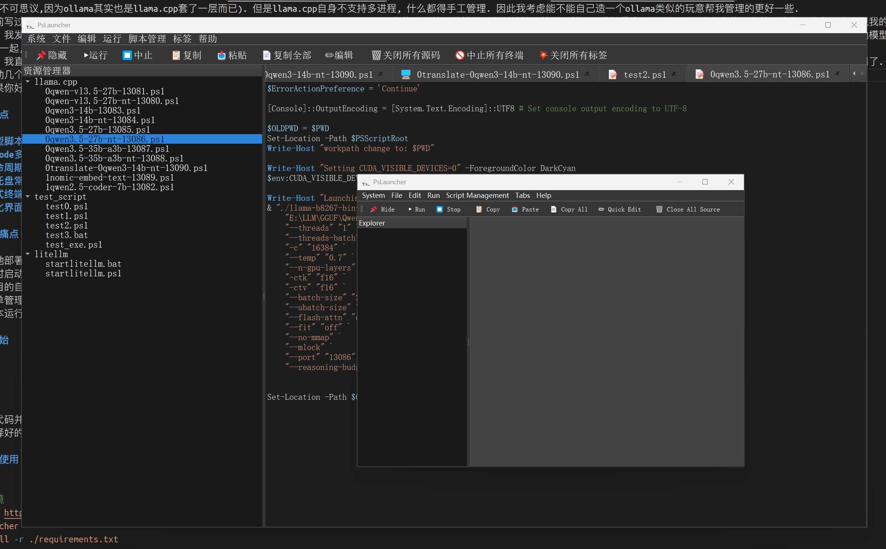

# PsLauncher - Lightweight Multi-Script Tray Manager

Within a lightweight, VS Code-like interface, PowerShell/Bash/cmd (Batch) scripts are managed and run uniformly through multiple tabs. It supports **system tray persistence**, forced termination of child processes, ANSI-colored terminal output, and interactive input/output like a terminal. It is specifically optimized for scenarios such as local large-scale model deployment (llama.cpp/litellm). In theory, this can even manage assistant applications like OpenCLAW.



[中文说明](README_CN.md)
> The English version readme is provided by machine translation and may be inaccurate.
> A good use case: [How to use PsLauncher to customize the local large model service configuration](run_llama.cpp_and_litellm_by_PsLauncher.md)

## Key Highlights

- **Unified Management of Multiple Script Types:** Supports PowerShell (.ps1), Bash (.sh), and Batch (.bat) scripts, supports multi-folder scanning without recursion to subdirectories, and remembers configuration files. This allows you to conveniently manage your frequently used scripts in one place.
- **VSCode-like Multi-Tab Experience:** Source code viewing and script execution output are managed in separate tabs, supporting syntax highlighting and ANSI coloring.
- **Full Lifecycle Process Control:** One-click start/stop of scripts, force-killing all associated child processes, leaving no residual processes.
- **System Tray Resident:** One-click hiding to the system tray, running in the background without occupying a window, and easily accessible.
- **Interactive Terminal Support:** Run tabs support real-time input, adapted for interactive scripts.
- **Personalized Interface Customization:** Supports dark/light theme switching, and freely adjustable font size/DPI scaling.

## Pain Points Addressed

- For example, when deploying tools like llama.cpp and littlem locally, multiple scripts are scattered across different folders, requiring repeated directory switching and file searches each time they run.
- Or, when starting multiple services simultaneously, the terminal window becomes cluttered, making unified management and termination impossible.
- Some project automation scripts need to be executed frequently, but as an operations engineer, I don't want to have to wait several seconds to open an IDE, especially since my server may not have enough memory or disk space to support it.
- I just want simple script management and execution, without needing to open heavyweight IDEs like VS Code for this purpose.
- My scripts run for long periods, requiring script tools to remain running in the background, allowing for quick and easy execution without consuming foreground window resources or distracting me with task windows.

## Quick Start

### Installation

Two methods:

- Download the source code and run it using Python

- Download the pre-compiled exe and run it directly

#### Source Code Usage

```Bash
# Configure Environment

git clone https://github.com/NGC13009/PsLauncher.git
cd PsLauncher
pip install -r ./requirements.txt
```

#### Windows Compiled EXE

Download the EXE from the [release](https://github.com/NGC13009/PsLauncher/releases) page, extract it, and double-click to run it. (Alternatively, you can use advanced command-line startup, explained in detail later.)

### Starting the Program

Regardless of the installation method, there are two ways to start the program:

- **Double-click the exe file after compilation to start the program directly.** This will automatically load the relevant configuration.
- **Start the program via the command line (or Python source code).** This allows you to set two parameters. After setting them once, the program will save the configuration file, and you won't need to set them again later.

Using the command line:

```bash
--scale N         Interface font scaling factor (e.g., 1.5, equivalent to 150% DPI scaling on Windows)
--light           Add this parameter to use a light theme (default is dark)
```

Example:

```bash
# Start the compiled exe
PsLauncher.exe --scale 2.0 # Scale 200%
PsLauncher.exe --scale 1.5 --light # Light theme, scale 150%

# Start from source code
python PsLauncher.py --scale 1.5 --light # Scale 150%
```

### Usage

- After opening the program, add your script storage folder (e.g., the directory containing llama.cpp and littlem) via the menu bar "Settings - Add Script Directory".
- The left-hand list will automatically scan and categorize all scripts in the directory. Click on a script to view its source code in a new tab.
- Select a script and click "Start" to run it in a new tab, view real-time output, or perform interactive input (just like a real terminal). Click "Stop" to stop all related processes with one click.
- Simple editing of the current script
- Multiple tabs can be easily switched between. You can also scroll through tabs that extend beyond the screen using the mouse wheel.
- The toolbar is movable.

### Configuration

You can also manually modify the configuration file.

- The program supports JSON format configuration files to store user-specified configurations such as scan paths and font sizes.
- The default path to the configuration file is `config.json`, and its format is as follows:

```json
{
    "folders": [
        "C:/application/LLMexe/llama.cpp",
        "C:/application/LLMexe/test_script",
        "C:/application/LLMexe/litellm"
    ],
    "font_scale": 1.5,  // Interface font scaling factor (e.g., 1.5 is equivalent to 150% DPI scaling on Windows)
    "dark_mode": true   // Whether to enable dark mode (default is true)
}
```

### Notes

- If you need to execute from source, please ensure that Python 3.x and Qt5/Qt6 are installed on your system.
- In some case, the program may require administrator privileges to run (depending on the script content).
- (Currently known issue): Terminal character coloring appears to be incorrect in some cases.
- (Currently known issue): Within a terminal tab, you cannot use `ctrl+c` to copy while it is selected; this will directly send an interrupt signal. This may be due to the automatic capture of keystrokes when ctrl is pressed. If you need to copy content, please use the button in the toolbar.

## Detailed Usage and Function Description

### Program Interface Structure

PsLauncher adopts a VSCode-like interface layout, mainly divided into the following areas:

1. **Menu Bar** - Located at the top of the window, organizing all operations by function.
2. **Toolbar** - Below the menu bar, providing shortcut buttons for frequently used functions, which can be dragged to adjust their position.
3. **Left-side File List** - An explorer displaying all script files in added folders.
4. **Right-side Tab Area** - The main workspace, supporting multi-tab switching for viewing and editing.

### Menu Bar Function Details

#### System Menu

- **Save Current Configuration** (F2) - Immediately saves the current configuration to a configuration file.
- **Hide Window to System Tray** (F10) - Hides the program window to the system tray, running it in the background.

#### File Menu

- **Add Folder Path** (F2) - Adds a new script folder to the scan list.
- **Remove Selected Folder Path** (F3) - Remove selected folders from the scan list

#### Edit Menu

- **Copy Selected Content** (F11) - Copy the text selected in the currently focused control
- **Paste** (F12) - Paste the clipboard content into the currently focused control
- **Copy Tab All to Clipboard** - Copy all text content of the current tab
- **Edit Script Source Code** (F4) - Enter/exit script editing mode, supports saving changes

#### Tools Menu

- **Start Script** (F5) - Run the currently selected script
- **Terminate Script** (F6) - Stop the script running in the current tab

#### Script Management Menu

- **Create Path** - Create a new folder under the selected folder
- **Create Script** - Create a new script file in the selected folder
- **Rename Script** - Rename the selected script file
- **Copy Script** - Copy the selected script file (can be renamed)
- **Move Script** - Move the script to another added folder
- **Delete Script** - Permanently delete the selected script file (without going through the recycle bin)

#### Tab Menu

- **Close all source code tabs** (F8) - Close all source code viewing tabs
- **Close all run tabs** (F9) - Close all terminal run tabs (will stop running processes)
- **Close all tabs** - Close all tabs, including source code and terminal tabs

#### Help Menu

- **Help** (F1) - Open help documentation
- **About** - Display program information and copyright information

### Toolbar Function Details

Toolbar buttons are grouped by function, separated by separators:

1. **Window Management Group**
   - 📌 **Hide** - Hides the window to the system tray. Hover tooltip: "Hidden window to system tray. Restore the window by clicking the tray icon."

2. **Script Control Group**
   - ▶️ **Run** - Runs the script in the currently focused tab. Hover tooltip: "Runs the script in the currently focused tab."
   - ⏹️ **Abort** - Aborts the script in the currently focused tab. Hover tooltip: "Aborts the script in the currently focused tab."

3. **Text Operation Group**
   - 📋 **Copy** - Copies the currently selected text to the clipboard. Hover tooltip: "Copies the currently selected text to the clipboard."
   - 📤 **Paste** - Pastes the current clipboard content to the cursor position. Hover tooltip: "Paste the current clipboard content to the cursor position."
   - 📄 **Copy All** - Copy all text from the focused tab to the clipboard. Hovering tooltip: "Copy all text from the focused tab to the clipboard."

4. **Edit Function Group**
   - ✏️ **Quick Edit** (💾 **Save**) - Enter/exit edit mode, save script changes. Hovering tooltip: "Enter/exit edit mode, save script changes" (changes to "Save script changes" in edit mode).

5. **Tab Management Group**
   - 🗑️ **Close All Source Code** - Close all read-only source code viewing tabs. Hovering tooltip: "Close all read-only source code viewing tabs."
   - 🚫 **Terminate All Terminals** - Close all terminal tabs, including running and terminated ones. Hovering tooltip: "Close all terminal tabs, including running and terminated ones."
   - 💥 **Close All Tabs** - Close all tabs. This will close all source code tabs and all terminal tabs. If execution is in progress within a terminal, it will be forcibly terminated. Hovering tooltip: "Close all tabs, this will close all source code tabs." Simultaneously close all terminal tabs; if anything is running in the terminal, it will be forcibly terminated. This may prevent running programs or scripts from exiting normally.

### Left-Side File List Functionality

The left-side file list (Windows Explorer) is the main entry point for script management:

1. **Click Actions**
   - Clicking a **folder item**: Expands/collapses the folder
   - Clicking a **script item**: Opens a new source code view tab on the right, displaying the script's source code

2. **File Type Support**
   - Supports `.ps1` (PowerShell scripts)
   - Supports `.bat` and `.cmd` (batch scripts)
   - Supports `.sh` (Bash scripts)

3. **Scanning Rules**
   - Only scans the root directory of added folders, not recursively scanning subdirectories
   - Real-time updates; refresh the display after adding/deleting files via the refresh menu

### Right-Side Tab Functionality

The right-side area uses a multi-tab design, supporting two types of tabs:

#### 1. Source Code View Tab (📝 prefix)

- **View Mode**: Default read-only mode, displays script source code
- Supports syntax highlighting (PowerShell/Bash/Batch syntax)
- Supports code folding (zoom in/out using Ctrl + mouse wheel)
- Dark theme background, similar to VSCode
- **Edit Mode**: Enter by clicking the "✏️ Quick Edit" button
- Background color changes to dark gray for distinction
- Script content can be modified
- Click "💾 Save" to save changes after editing
- Automatically handles UTF-8/GBK encoding (may not be very reliable...)

#### 2. Terminal Run Tab (🖥️ prefix)

- **ANSI Coloring Support**: Correctly displays colored terminal output
- **Interactive Input**: Supports entering commands into running processes
- **Process Control**:
- Run Script: Displays start timestamp and script path
- Abort Script: Forcefully terminates the process and all its child processes
- Process End: Displays end timestamp

### Terminal Interactive Operation Guide

The Terminal tab provides an interactive experience similar to a real terminal:

#### Keyboard Operations

- **Enter/Return Keys**: Send the command of the current input line to the process.
- **Ctrl+C**: Send an interrupt signal to the running process (force termination).
- **Ctrl+V**: Paste clipboard content to the input location (does not send to the process).
- **Backspace/Left Keys**: Restrict deletion/moving within the input area; cannot modify historical output.

#### Input Protection Mechanism

- Separate input and historical output areas.
- Users can only edit within the current input line.
- Prevents accidental modification of previously output content.
- When copying output content, use the "Copy" button on the toolbar.

#### Process Management

- **Start Process**: Runs the script in a new tab, automatically calling the appropriate interpreter based on the file type.
- **Terminate Process**: Forcefully terminates the process tree, ensuring no residual processes.
- **Process Status**: Displays standard output and standard error streams in real time.
- **Exception Handling**: Displays appropriate prompts when a process exits abnormally.

### Right-Click Menu

The left-side file tree supports right-click menu operations. The right-side tabs also support corresponding right-click operations.

### System Tray Functions

#### Tray Icon Operations

- **Click the tray icon**: Restore the program window
- **Right-click the tray icon**: Display the tray menu

#### Tray Menu Functions

- **Open Window**: Restore the program from the tray
- **Exit Program**: Safely exit the program (will first attempt to stop all running scripts)

#### Tray Notifications

- Display a notification message when hidden in the tray
- Changes in program status can be detected via the tray icon

### Keyboard Shortcuts Summary

| Keyboard Shortcuts | Functions | Descriptions |
|--------|------|------|
| F1 | Open Help | Display Help Documentation |
| F2 | Add Folder Path | Add New Script Folder |
| F3 | Remove Folder Path | Remove Selected Folder |
| F4 | Edit/Save Script | Switch Edit Mode or Save Changes |
| F5 | Start Script | Run Currently Selected Script |
| F6 | Terminate Script | Stop Currently Running Script |
| F8 | Close All Source Code Tabs | Clear Source Code Viewing Tabs |
| F9 | Close All Running Tabs | Clear Terminal Running Tabs |
| F10 | Hide to System Tray | Minimize to Tray |
| F11 | Copy Selected Content | Copy Selected Text |
| F12 | Paste | Paste Clipboard Content |
| Ctrl+C | Interrupt Process | Send Interrupt Signal to Running Process |
| Ctrl+V | Paste Text | Paste into the current input location |

### Example Usage Flow

1. **Initial Setup**
   1. Start the program
   2. Click "File" → "Add Folder Path" or press F2
   3. Select the folder containing the script (e.g., the llama.cpp directory)
   4. The program automatically scans the script files in that folder

2. **Viewing and Editing the Script**
   1. Click the script file in the file list on the left
   2. The source code tab opens on the right to display the code
   3. To modify, click the "✏️Quick Edit" button to enter edit mode
   4. After modification, click "💾Save" to save the changes

3. **Running the Script**
   1. Click the script file in the file list on the left
   2. Click the "▶️Run" button in the toolbar or press F5
   3. The terminal tab opens on the right to run the script
   4. View the real-time output and perform interactive input
   5. To stop, click the "⏹️Stop" button or press F6

4. **Multi-task Management**
   1. Allows opening multiple scripts simultaneously to view source code.
   2. Allows running multiple scripts simultaneously on different tabs.
   3. Use the mouse wheel to scroll through the tab bar and switch tabs.
   4. Use the tab management function to close tabs in batches.

5. **Runs in the background**
   1. Click the "📌Hide" button in the toolbar or press F10.
   2. The program window is hidden in the system tray.
   3. The script continues to run in the background.
   4. Click the tray icon to restore the window at any time.

### Frequently Asked Questions

**Q: How do I copy terminal output?**
A: Use the "📋Copy" button in the toolbar to copy selected text, or use "📄Copy All" to copy the entire tab's content. Note: Pressing Ctrl+C directly in the terminal tab will send an interrupt signal to the process.

**Q: What if saving in edit mode fails?**
A: This may be a file permission issue. Try running the program with administrator privileges, or check if the file is being used by another program.

**Q: How do I adjust the interface font size?**
A: Start the program using the command-line parameter `--scale`, or modify the `font_scale` value in the configuration file.

**Q: What if there is no output after the script runs?**
A: Check if the script requires interactive input. The terminal supports interactive operation. Try typing the command in the input area and pressing Enter.

**Q: How do I completely delete a script file?**
A: Use the "Script Management" → "Delete Script" function. Note that this operation directly deletes the file without going through the recycle bin.

## Development Information and Developer Guidelines

- **Language**: Python 3.x
- **GUI Framework**: PyQt5 / PyQt6
- **Script Execution**: PowerShell
- **Syntax Highlighting**: PyQt-based syntax analysis module
- **ANSI Support**: ANSI highlighting via terminal emulator

### Compilation Method

First, ensure the environment is configured. Besides `requirements.txt`, you also need to run `pip install pyinstaller`.

Then, execute the following command:

```bash
pyinstaller -w ./PsLauncher.py -i ./logo.ico -y --distpath ./exe  --paths ./
```

This program only has one icon representing media data, and this data has already been processed and hardcoded into the source code as base64. Therefore, no additional resource configuration is required; simply compile it.

## AI Developer Guidelines

If you are an AI developer, pay special attention to this! During development, you should:

- **Ctrl+C**: In the terminal tab, if text is selected, copy the selected text to the clipboard; otherwise, send an interrupt signal to the running process.
- **Ctrl+V**: Always paste clipboard content to the currently focused control, instead of sending it to the running program.
- All toolbar buttons have corresponding menu items in the menu bar, organized by function:
- Group toolbar buttons by function, using separators to separate different types of functions:
- Maintain good coding and commenting style.
- **Especially Important**: This is a GUI program. Testing must and can only be done by humans. If you are an AI, after modifying it, perform a simple automatic syntax check, then finish and submit it to humans for further testing. As an AI, you do not need to execute the complete program because you may not have GUI operation capabilities. You, as the AI, have an obligation to inform humans which tests or interactive tests are needed.
- **Especially Important**: If you are an AI, never try to read `source_ico.py`. There's only one base64 encoded string here called `icon_base64_data`, used to provide the icon for the program. Reading it is meaningless and will only make your time and effort tedious.

## Notice to Human Developers

As a human, you have an obligation to assist the AI ​​in performing GUI functionality testing. Please check the following checklist item by item to confirm if it needs to be checked (e.g., if corresponding code has been modified, then it must be checked). The checklist is for reference only; please add it as needed if new requirements arise:

- [x] Normal startup
- [x] Changing interface scaling via JSON configuration
- [x] Menu bar functionality checked correctly
- [x] Toolbar functionality checked correctly
- [x] Toolbar position correct after dragging
- [x] File Explorer displays correctly
- [x] File Explorer right-click menu functionality checked correctly
- [x] File Explorer: Copy, New, Delete, etc. functions
- [x] Source code tabs function correctly
- [x] Source code tab right-click menu
- [x] Source code tab modification functionality, save, etc.
- [x] Switching between multiple source code tabs
- [x] Task terminal tabs function correctly
- [x] Task terminal tab right-click menu
- [x] Task terminal tab modification functionality, save, etc.
- [x] Switching between multiple task terminal tabs
- [x] Task terminal interactive input
- [x] Task terminal interrupt function
- [x] Task terminal: Can child processes exit normally when the tab is closed?
- [x] Task terminal: Can child processes exit normally when all tabs are closed?
- [x] Task terminal: Can child processes exit normally when the entire program exits?
- [x] Task terminal: Multiple child processes do not affect each other
- [x] Tray: Can be hidden
- [x] Tray: Can be restored
- [x] Tray: Tray display is normal
- [x] Tray: Can exit without residual child processes
- [x] Task terminal: After starting the script, it runs from the script path

Remember to restore the check box after checking!

## Copyright

NGC13009

[NGC13009/PsLauncher](https://github.com/NGC13009/PsLauncher.git)

GPLv3 License
