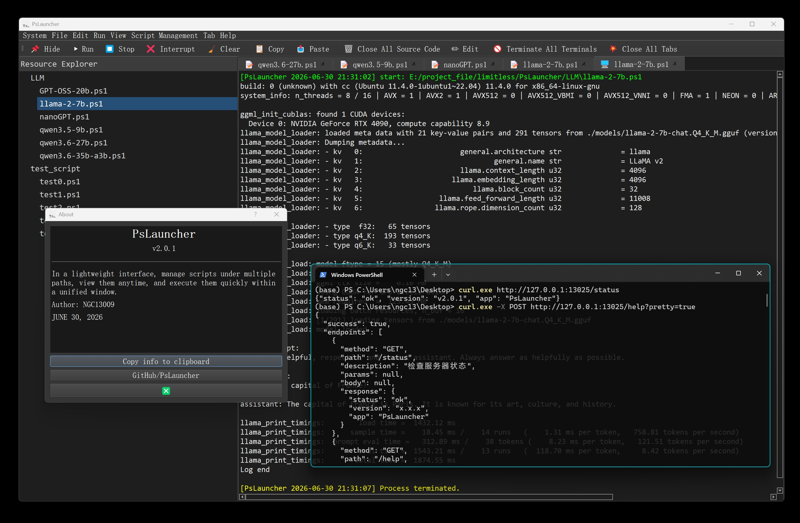

# PsLauncher - Lightweight Multi-Script Tray Manager

Within a lightweight, VS Code-like interface, PowerShell/Bash/cmd (Batch) scripts are managed and run uniformly through multiple tabs. It supports **system tray persistence**, forced termination of child processes, ANSI-colored terminal output, and interactive input/output like a terminal. It is specifically optimized for scenarios such as local large-scale model deployment (llama.cpp/litellm). In theory, this can even manage assistant applications like OpenCLAW.



[中文说明](README_CN.md)
> The English version readme is provided by machine translation and may be inaccurate.
> A good use case: [How to use PsLauncher to customize the local large model service configuration](run_llama.cpp_and_litellm_by_PsLauncher.md)

## Key Highlights

- **Unified Management of Multiple Script Types:** Supports PowerShell (.ps1), Bash (.sh), and Batch (.bat) scripts, supports multi-folder scanning without recursion to subdirectories, and remembers configuration files. This allows you to conveniently manage your frequently used scripts in one place.
- **VSCode-like Multi-Tab Experience:** Source code viewing and script execution output are managed in separate tabs, supporting syntax highlighting and ANSI coloring.
- **Full Lifecycle Process Control:** One-click start/stop of scripts, force-killing all associated child processes, leaving no residual processes.
- **System Tray Resident:** One-click hiding to the system tray, running in the background without occupying a window, and easily accessible.
- **Interactive Terminal Support:** Run tabs support real-time input, adapted for interactive scripts.
- **Personalized Interface Customization:** Supports dark/light theme switching, and freely adjustable font size/DPI scaling.

## Pain Points Addressed

- For example, when deploying tools like llama.cpp and littlem locally, multiple scripts are scattered across different folders, requiring repeated directory switching and file searches each time they run.
- Or, when starting multiple services simultaneously, the terminal window becomes cluttered, making unified management and termination impossible.
- Some project automation scripts need to be executed frequently, but as an operations engineer, I don't want to have to wait several seconds to open an IDE, especially since my server may not have enough memory or disk space to support it.
- I just want simple script management and execution, without needing to open heavyweight IDEs like VS Code for this purpose.
- My scripts run for long periods, requiring script tools to remain running in the background, allowing for quick and easy execution without consuming foreground window resources or distracting me with task windows.

## Quick Start

> The in-program documentation is automatically generated from Markdown. Therefore, the Markdown files or GitHub web rendering will display correctly, but the built-in documentation within the program may not always be fully accessible. Please refer to the Markdown or web documentation as the authoritative source.

### Installation

Two methods:

- Download the source code and run it using Python

- Download the pre-compiled exe and run it directly

#### Source Code Usage

```Bash
# Configure Environment

git clone https://github.com/NGC13009/PsLauncher.git
cd PsLauncher
pip install -r ./requirements.txt
```

#### Windows Compiled EXE

Download the EXE from the [release](https://github.com/NGC13009/PsLauncher/releases) page, extract it, and double-click to run it. (Alternatively, you can use advanced command-line startup, explained in detail later.)

### Starting the Program

Regardless of the installation method, there are two ways to start the program:

- **Double-click the exe file after compilation to start the program directly.** This will automatically load the relevant configuration.
- **Start the program via the command line (or Python source code).** This allows you to set two parameters. After setting them once, the program will save the configuration file, and you won't need to set them again later.

Using the command line:

```bash
usage: PsLauncher.py [-h] [--scale SCALE] [--light] [--dark] [--font FONT] [--height HEIGHT] [--width WIDTH]

PsLauncher - A general script launcher

options:
  -h, --help       show this help message and exit
  --scale SCALE    Interface font scaling factor (e.g., 1.5, equivalent to 150% DPI scaling on Windows)
  --light          use light theme
  --dark           use dark theme
  --font FONT      set font family
  --height HEIGHT  window height
  --width WIDTH    window width
```

Example:

```bash
# Start the compiled exe
PsLauncher.exe --scale 2.0 # Scale 200%
PsLauncher.exe --scale 1.5 --light # Light theme, scale 150%

# Start from source code
python PsLauncher.py --scale 1.5 --light # Scale 150%
```

### Usage

- After opening the program, add your script storage folder (e.g., the directory containing llama.cpp and littlem) via the menu bar "Settings - Add Script Directory".
- The left-hand list will automatically scan and categorize all scripts in the directory. Click on a script to view its source code in a new tab.
- After selecting a script, click Start to run it in a new tab. You can view real-time output, perform interactive input (just like a real terminal), or click Stop to forcefully terminate all related processes. Click Interrupt to send a Ctrl+C signal for a graceful shutdown.
- Simple editing of the current script
- Multiple tabs can be easily switched between. You can also scroll through tabs that extend beyond the screen using the mouse wheel.
- The toolbar is movable.

### Configuration

You can also manually modify the configuration file.

- The program supports JSON format configuration files to store user-specified configurations such as scan paths and font sizes.
- The default path to the configuration file is `config.json`, and its format is as follows:

```json
{
    "folders": [
        "C:/application/LLMexe/llama.cpp",
        "C:/application/LLMexe/test_script",
        "C:/application/LLMexe/litellm"
    ],
    "font_scale": 1.5,        // Interface font scaling factor (e.g., 1.5 is equivalent to 150% DPI scaling on Windows)
    "dark_mode": true,        // Whether to enable dark mode (default is true)
    "height_value": 1366,     // window size height
    "width_value": 768,       // window size width
    "font_family": "Consolas" // font family
}
```

### Notes

- If you need to execute from source, please ensure that Python 3.x and Qt5/Qt6 are installed on your system.
- In some case, the program may require administrator privileges to run (depending on the script content).
- (Currently known issue): Terminal character coloring appears to be incorrect in some cases.

## Detailed Usage and Function Description

### Program Interface Structure

PsLauncher adopts a VSCode-like interface layout, mainly divided into the following areas:

1. **Menu Bar** - Located at the top of the window, organizing all operations by function.
2. **Toolbar** - Below the menu bar, providing shortcut buttons for frequently used functions, which can be dragged to adjust their position.
3. **Left-side File List** - An explorer displaying all script files in added folders.
4. **Right-side Tab Area** - The main workspace, supporting multi-tab switching for viewing and editing.

### Menu Bar Function Details

#### System Menu

- **Save Current Configuration** (F2) - Immediately saves the current configuration to a configuration file.
- **Hide Window to System Tray** (F10) - Hides the program window to the system tray, running it in the background.
- **Automatically minimize to tray on startup** - When checked, the application will automatically hide to the system tray every time it starts

#### File Menu

- **Add Folder Path** (F2) - Adds a new script folder to the scan list.
- **Remove Selected Folder Path** (F3) - Remove selected folders from the scan list

#### Edit Menu

- **Copy Selected Content** (F11) - Copy the text selected in the currently focused control
- **Paste** (F12) - Paste the clipboard content into the currently focused control
- **Copy Tab All to Clipboard** - Copy all text content of the current tab
- **Clear Terminal Screen** (Ctrl+L) - Clear all displayed content in the current terminal tab, resetting the screen to a blank state
- **Edit Script Source Code** (F4) - Enter/exit script editing mode, supports saving changes

#### Run Menu

- **Start Script** (F5) - Run the currently selected script
- **Stop Script (Force Terminate)** (F6) - Forcefully terminate the script running in the current tab and all its child processes (kill process tree)
- **Send Ctrl+C Interrupt** (F7) - Send a Ctrl+C interrupt signal (0x03) to the current terminal process for a graceful shutdown

#### View Menu

- **Toggle Word Wrap** - Enable/disable text automatic line wrapping
- **Syntax Highlighting Style** - Set code highlighting theme:
  - Automatic (auto-detects based on script type)
  - PowerShell
  - bash
  - command
  - Disable (turn off highlighting)

#### Script Management Menu

- **Create Path** - Create a new folder under the selected folder
- **Create Script** - Create a new script file in the selected folder
- **Rename Script** - Rename the selected script file
- **Copy Script** - Copy the selected script file (can be renamed)
- **Move Script** - Move the script to another added folder
- **Delete Script** - Permanently delete the selected script file (without going through the recycle bin)

#### Tab Menu

- **Close all source code tabs** (F8) - Close all source code viewing tabs
- **Close all run tabs** (F9) - Close all terminal run tabs (will stop running processes)
- **Close all tabs** - Close all tabs, including source code and terminal tabs

#### Help Menu

- **Help** (F1) - Open help documentation
- **About** - Display program information and copyright information

### Toolbar Function Details

Toolbar buttons are grouped by function, separated by separators:

1. **Window Management Group**
   - 📌 **Hide** - Hides the window to the system tray. Hover tooltip: "Hidden window to system tray. Restore the window by clicking the tray icon."

2. **Script Control Group**
   - ▶️ **Run** - Runs the script in the currently focused tab. Hover tooltip: "Runs the script in the currently focused tab."
   - ⏹️ **Stop** - Forcefully terminates the script in the currently focused tab (kills the process tree), Hover tooltip: "Stop the script in the currently focused tab (force kill process tree)"
   - ❌ **Interrupt** - Sends a Ctrl+C interrupt signal (0x03) to the current terminal process for a graceful shutdown, Hover tooltip: "Send a Ctrl+C interrupt signal (0x03) to the current terminal process for a graceful shutdown"
   - 🧹**Clear** - Clear all displayed content in the current terminal tab, tooltip: "Clear all displayed content in the current terminal tab"

3. **Text Operation Group**
   - 📋 **Copy** - Copies selected text to the clipboard (if no text is selected, copies all content from the focused tab), Hover tooltip: "Copy selected text to the clipboard; if no content is selected, copy all text from the focused tab."
   - 📤 **Paste** - Pastes the current clipboard content to the cursor position. Hover tooltip: "Paste the current clipboard content to the cursor position."
   - 📄 **Copy All** - Copy all text from the focused tab to the clipboard. Hovering tooltip: "Copy all text from the focused tab to the clipboard."

4. **Edit Function Group**
   - ✏️ **Quick Edit** (💾 **Save**) - Enter/exit edit mode, save script changes. Hovering tooltip: "Enter/exit edit mode, save script changes" (changes to "Save script changes" in edit mode).

5. **Tab Management Group**
   - 🗑️ **Close All Source Code** - Close all read-only source code viewing tabs. Hovering tooltip: "Close all read-only source code viewing tabs."
   - 🚫 **Terminate All Terminals** - Close all terminal tabs, including running and terminated ones. Hovering tooltip: "Close all terminal tabs, including running and terminated ones."
   - 💥 **Close All Tabs** - Close all tabs. This will close all source code tabs and all terminal tabs. If execution is in progress within a terminal, it will be forcibly terminated. Hovering tooltip: "Close all tabs, this will close all source code tabs." Simultaneously close all terminal tabs; if anything is running in the terminal, it will be forcibly terminated. This may prevent running programs or scripts from exiting normally.

### Left-Side File List Functionality

The left-side file list (Windows Explorer) is the main entry point for script management:

1. **Click Actions**
   - Clicking a **folder item**: Expands/collapses the folder
   - Clicking a **script item**: Opens a new source code view tab on the right, displaying the script's source code

2. **Double-click operation**
   - Double-clicking a folder toggles the expansion or collapse of its contents.

3. **File Type Support**
   - Supports `.ps1` (PowerShell scripts)
   - Supports `.bat` and `.cmd` (batch scripts)
   - Supports `.sh` (Bash scripts)

4. **Scanning Rules**
   - Only scans the root directory of added folders, not recursively scanning subdirectories
   - Real-time updates; refresh the display after adding/deleting files via the refresh menu

### Right-Side Tab Functionality

The right-side area uses a multi-tab design, supporting two types of tabs:

#### 1. Source Code View Tab (📝 prefix)

- **View Mode**: Default read-only mode, displays script source code
- Supports syntax highlighting (PowerShell/Bash/Batch syntax)
- Supports zoom in/out using Ctrl + mouse wheel
- Dark theme background, similar to VSCode
- **Edit Mode**: Enter by clicking the "✏️ Quick Edit" button
- Background color changes to dark gray for distinction
- Script content can be modified
- Click "💾 Save" to save changes after editing
- Automatically handles UTF-8/GBK encoding (may not be very reliable...)

#### 2. Terminal Run Tab (🖥️ prefix)

- **ANSI Coloring Support**: Correctly displays colored terminal output
- **Interactive Input**: Supports entering commands into running processes
- **Process Control**:
- Run Script: Displays start timestamp and script path
- Abort Script: Forcefully terminates the process and all its child processes
- Process End: Displays end timestamp

### Terminal Interactive Operation Guide

The Terminal tab provides an interactive experience similar to a real terminal:

#### Keyboard Operations

- **Enter/Return Key**: Sends the command of the current input line to the process
- **Ctrl+C**: Handled uniformly by the global event filter; if text is selected, it copies to the clipboard, otherwise triggers global copy logic (copies all content from the focused tab) or delegates to the focused control. It no longer forcibly terminates the process directly.
- **Ctrl+X**: Cuts the selected text of the currently focused control
- **Ctrl+Z**: Performs undo operation on the currently focused QTextEdit control
- **Ctrl+Y**: Performs redo operation on the currently focused QTextEdit control
- **Ctrl+V**: Pastes clipboard content to the input location (does not send to the process)
- **Backspace/Left Key**: Deletion/movement is restricted within the input area and cannot modify historical output

#### Input Protection Mechanism

- Separate input and historical output areas.
- Users can only edit within the current input line.
- Prevents accidental modification of previously output content.
- When copying output content, use the "Copy" button on the toolbar.

#### Process Management

- **Start Process**: Runs the script in a new tab, automatically calling the appropriate interpreter based on the file type.
- **Terminate Process**: Forcefully terminates the process tree, ensuring no residual processes.
- **Process Status**: Displays standard output and standard error streams in real time.
- **Exception Handling**: Displays appropriate prompts when a process exits abnormally.

### Right-Click Menu

The file tree on the left supports right-click menu operations, and the tabs on the right support corresponding right-click actions.

#### New Right-Click Menu Features

- **▶️ Run**: Directly execute the selected script.
- **✏️ Edit/Save**: Open the script source code and enter edit mode.
- **🔄 Auto-start on Launch / 🔄 Stop Auto-start**: Mark the script to run automatically at launch (only available for executable extensions `.ps1`/`.bat`/`.sh`). When marked, the script will be highlighted in blue within the file tree, and the hover tooltip will indicate "Auto-starting on launch".
- **💻 Edit with VSC**: Attempt to open the selected file in VSCode using the `code` command. If VSCode is not installed or not in the PATH, a friendly error message will be displayed.
- **📝 Rename**: Rename the selected script.
- **📋 Copy**: Copy the selected script.
- **🚚 Move**: Move the script to another folder.
- **🗑️ Delete**: Permanently delete the selected script.

#### Auto-start Configuration

For scripts that need to run as system services (e.g., local services), configure them using the following steps:

1. Right-click the target script in the file tree and select **🔄 Auto-start on Launch**.
2. The script will be highlighted in blue in the file tree for easy identification.
3. The next time PsLauncher is started, the script will automatically run in the terminal tab.
4. To disable it, right-click and select **🔄 Stop Auto-start**.

When combined with the **Auto-minimize to Tray on Startup** feature, this enables seamless background service management that starts automatically with the system.

#### Tray Notifications

- Display a notification message when hidden in the tray
- Changes in program status can be detected via the tray icon

### Keyboard Shortcuts Summary

| Shortcut | Function | Description |
| :--- | :--- | :--- |
| F1 | Open Help | Display help documentation |
| F2 | Add Folder Path | Add a new script folder |
| F3 | Remove Folder Path | Remove the selected folder |
| F4 | Edit/Save Script | Toggle edit mode or save changes |
| F5 | Start Script | Run the currently selected script |
| F6 | Stop Script (Force Terminate) | Forcefully terminate the currently running script and all its child processes (kill process tree) |
| F7 | Send Ctrl+C Interrupt | Send a Ctrl+C interrupt signal (0x03) to the current terminal process for a graceful shutdown |
| F8 | Close All Source Tabs | Clear source code viewing tabs |
| F9 | Close All Run Tabs | Clear terminal running tabs |
| F10 | Hide to System Tray | Minimize to tray to run |
| F11 | Copy Selected Content | Copy selected text |
| F12 | Paste | Paste clipboard content |
| Ctrl+C | Copy / Global Handling | If text is selected, copy to clipboard; if no selection, trigger global copy (copy all content from the tab) or delegate to the focused control |
| Ctrl+V | Paste | Paste clipboard content to the currently focused control |
| Ctrl+X | Cut | Cut the selected text of the currently focused control |
| Ctrl+Z | Undo | Perform undo operation on the currently focused QTextEdit control |
| Ctrl+Y | Redo | Perform redo operation on the currently focused QTextEdit control |
| Ctrl+L | Clear Terminal Screen | Clear all displayed content in the current terminal tab |

### Configuration File

Some settings cannot be configured directly within the application.

Locate the root directory of the executable file to find the configuration file (if it doesn't exist, running the program once will generate it).

Open it in a text editor to manually modify parameters, such as the default window size, etc.

```python
_default_config = {
    "folders": [],                       # list[str]: List of folder paths
    "font_scale": 1.5,                   # float: Font size scaling
    "dark_mode": True,                   # bool: Enable dark mode
    'height_value': 1080,                # int
    'width_value': 1920,                 # int
    'font_family': 'Consolas',           # str
    'line_wrap_mode': True,              # bool
    'supported_extensions': ['.ps1', '.bat', '.sh'], # list[str]: List of file extensions to display in the file tree (must include at least ['.ps1', '.bat', '.sh'])
    'runnable_extensions': ['.ps1', '.bat', '.sh'],  # list[str]: List of file extensions that can be executed (must include at least ['.ps1', '.bat', '.sh'])
    'syntax_highlight_mode': 'auto'      # Syntax highlighting mode: 'auto', 'ps1', 'bash', 'command', 'none'
}
```

### Example Usage Flow

1. **Initial Setup**
   1. Start the program
   2. Click "File" → "Add Folder Path" or press F2
   3. Select the folder containing the script (e.g., the llama.cpp directory)
   4. The program automatically scans the script files in that folder

2. **Viewing and Editing the Script**
   1. Click the script file in the file list on the left
   2. The source code tab opens on the right to display the code
   3. To modify, click the "✏️Quick Edit" button to enter edit mode
   4. After modification, click "💾Save" to save the changes

3. **Running the Script**
   1. Click the script file in the file list on the left
   2. Click the "▶️Run" button in the toolbar or press F5
   3. The terminal tab opens on the right to run the script
   4. View the real-time output and perform interactive input
   5. To force stop, click the "⏹️ Stop" button or press F6 (kills process tree); to gracefully interrupt, click the "❌ Interrupt" button or press F7 (sends Ctrl+C signal)

4. **Multi-task Management**
   1. Allows opening multiple scripts simultaneously to view source code.
   2. Allows running multiple scripts simultaneously on different tabs.
   3. Use the mouse wheel to scroll through the tab bar and switch tabs.
   4. Use the tab management function to close tabs in batches.

5. **Runs in the background**
   1. Click the "📌Hide" button in the toolbar or press F10.
   2. The program window is hidden in the system tray.
   3. The script continues to run in the background.
   4. Click the tray icon to restore the window at any time.

### Frequently Asked Questions

**Q: How do I copy terminal output?**
A: Use the toolbar's "📋 Copy" button to copy selected text (or press Ctrl+C directly), or use "📄 Copy All" to copy the entire tab content. Now Ctrl+C is handled by the global event filter: it copies selected text if any, or copies all content from the focused tab if nothing is selected.

**Q: What if saving in edit mode fails?**
A: This may be a file permission issue. Try running the program with administrator privileges, or check if the file is being used by another program.

**Q: How do I adjust the interface font size?**
A: Start the program using the command-line parameter `--scale`, or modify the `font_scale` value in the configuration file.

**Q: What if there is no output after the script runs?**
A: Check if the script requires interactive input. The terminal supports interactive operation. Try typing the command in the input area and pressing Enter.

**Q: How do I completely delete a script file?**
A: Use the "Script Management" → "Delete Script" function. Note that this operation directly deletes the file without going through the recycle bin.

## Development Info & Developer Guidelines

- **Language**: Python 3.12+
- **GUI Framework**: PyQt5 / PyQt6 / PySide6

### Compilation

First, ensure the environment is set up. Besides `requirements.txt`, you also need to run `pip install pyinstaller`.

Then, execute the following command:

```bash
pyinstaller -w ./PsLauncher.py -i ./logo.ico -y --distpath ./exe --paths ./
```

This program only has one icon as media data, which has been processed into base64 and hardcoded into the source code. Therefore, no additional resource configuration is needed; you can compile directly.

### Release Process

The correct release workflow is as follows:

1. Update `__version__` and `__devdate__` inside `aboutandhelp.py`.
2. Execute `python get_help_page.py` to compile help pages for all languages (reads `README.md` for English, `README_CN.md` for Chinese, etc.).
3. If the .ico file has been updated, recompile it using `python get_ico.py`.
4. Compile the executable by running `pyinstaller -w ./PsLauncher.py -i ./logo.ico -y --distpath ./exe --paths ./`.
5. If necessary, include the help documentation as well.
6. run `get_zip_release.ps1` pack.

Correct release version structure:

```PowerShell
exe/
   PsLauncher_EN.exe
   PsLauncher_CN.exe
   _internal/*    # Required dynamic link libraries
```

### Multi-language Support

The script `code_translator.py` is used to translate the program into multiple languages.

> The author (@NGC13009) developed the project using a local repository. After initial development in Chinese, the code was automatically (and not necessarily reliably) translated into English and pushed to the current repository. The Chinese version was compiled locally by the author, while the English version is compiled using the current repository.

## Automated Testing & CI/CD

The project has a complete automated testing system based on `pytest` + `pytest-qt` + `pytest-xdist`, supporting headless parallel execution.

### Test Directory Structure

```
test/
├── conftest.py              # Global fixtures: env vars, temp config, main_window, etc.
├── test_config.py           # Func layer: config.json I/O, defaults, comment parsing, edge cases
├── test_scanner.py          # Func layer: folder scanning, no recursion, extension filtering
├── test_script_types.py     # Algo layer: .ps1/.bat/.sh detection, interpreter selection
├── test_process_control.py  # Func layer: process tree kill, Ctrl+C signal, no residual processes
├── test_ansi.py             # Algo layer: ANSI escape parsing and coloring
├── test_syntax_highlight.py # Algo layer: auto/ps1/bash/command/none mode detection
├── test_i18n.py             # Algo layer: i18n pure functions
├── test_utils.py            # Algo layer: utility functions (theme, font scaling)
├── test_autorun.py          # Func layer: auto-run toggle, blue highlight persistence
├── test_tray.py             # GUI layer: tray hide/restore/exit (skipif offscreen)
├── test_gui_main.py         # GUI layer: window construction, menu action trigger, tab management
├── test_gui_toolbar.py      # GUI layer: toolbar button mapping
├── test_gui_terminal.py     # GUI layer: terminal ANSI rendering, interactive input
├── test_gui_editor.py       # GUI layer: source tab read-only/edit, save, zoom
├── test_gui_tabs.py         # GUI layer: batch tab close, F8/F9 shortcuts
└── fixtures/
    ├── __init__.py
    ├── config_factory.py    # Config scenarios factory
    └── temp_scripts.py      # Temporary script directory
```

### Three-Layer Test Architecture

| Layer | Description | Parallel Safe | Marker |
|-------|-------------|---------------|--------|
| **Algorithm (algo)** | Pure functions, no Qt dependency | ✅ Safe | `@pytest.mark.algo` |
| **Functional (func)** | Business logic without QWidget instantiation (mockable) | ✅ Safe | `@pytest.mark.func` |
| **GUI (gui)** | pytest-qt interactive tests, requires qtbot fixture | ⚠️ Limited | `@pytest.mark.gui` |

### Execution Commands

**Minimal** (CI & local unified):

```bash
python -m pytest test/ -q --tb=short -p no:warnings --no-header
```

**Verbose** (local debugging):

```bash
python -m pytest test/ -v --tb=long -p no:warnings
```

**Non-GUI only** (quick regression):

```bash
python -m pytest test/ -q --tb=short -p no:warnings --no-header -m "not gui"
```

Parameter explanation:

- `-q`/`--no-header`: Minimal output, saves tokens
- `--tb=short`: Short traceback
- `-p no:warnings`: Suppress Python warnings
- `-n auto`: pytest-xdist parallel distribution by CPU cores
- `-m "not gui"`: Skip GUI-marked tests

### Headless Environment

pytest-qt requires the following setting in headless environments (CI/servers):

```bash
export QT_QPA_PLATFORM=offscreen   # Linux/macOS
set QT_QPA_PLATFORM=offscreen      # Windows CMD
$env:QT_QPA_PLATFORM="offscreen"   # Windows PowerShell
```

This is automatically set at the top of `conftest.py`. To specify the Qt API binding:

```bash
export PYTEST_QT_API=pyqt5
```

### CI Workflow

Defined in `.github/workflows/test.yml`, triggered by:

- `push` to `main` branch
- `pull_request` to `main` branch

Matrix: `ubuntu-latest` + `windows-latest`, Python 3.12.

### AI Agent Notes

- **AI only needs `py_compile` verification** after writing test code. Do NOT execute GUI tests yourself; leave them for human confirmation.
- Never attempt to read `source_ico.py`.
- GUI test coverage is limited under offscreen mode; tray/drag operations require manual verification.
- After development is complete, you must run `python -m pytest test/ -q --tb=long -p no:warnings` to execute the automated tests and confirm that everything passes.

### Human Developer Checklist

Mapping of the original "Human Developer Checklist" items to automation status:

| Check Item | Automation Status |
|------------|-------------------|
| Normal startup | ✅ `test_gui_main.py` |
| Menu bar functionality | ✅ `test_gui_main.py::TestMenuActions` |
| Toolbar functionality | ✅ `test_gui_toolbar.py` |
| Toolbar drag position | ⚠️ Manual check required |
| File explorer display | ✅ `test_scanner.py` |
| Right-click menu | ⚠️ Manual check required |
| Source code tabs | ✅ `test_gui_editor.py` |
| Source code edit/save | ✅ `test_gui_editor.py` |
| Multi-tab switching | ✅ `test_gui_main.py::TestTabManagement` |
| Terminal tabs | ✅ `test_gui_terminal.py` |
| Terminal interactive input | ✅ `test_gui_terminal.py` |
| Terminal interrupt | ✅ `test_process_control.py` |
| Child process exit on tab close | ✅ `test_process_control.py` |
| Child process exit on batch close | ✅ `test_gui_tabs.py` |
| Child process exit on app quit | ✅ `test_process_control.py` |
| Multi-process isolation | ⚠️ Manual verification needed |
| Tray hide/restore | ⚠️ Skipped in offscreen, manual check |
| Tray exit without residue | ⚠️ Manual check required |
| Script runs from its path | ✅ `test_process_control.py` |

**AI automated coverage:** 23 items ✅ / 5 items ⚠️ Manual

## Notice to Human Developers

As a human, you have an obligation to assist the AI ​​in performing GUI functionality testing. Please check the following checklist item by item to confirm if it needs to be checked (e.g., if corresponding code has been modified, then it must be checked). The checklist is for reference only; please add it as needed if new requirements arise:

- [x] Normal startup
- [x] Changing interface scaling via JSON configuration
- [x] Menu bar functionality checked correctly
- [x] Toolbar functionality checked correctly
- [x] Toolbar position correct after dragging
- [x] File Explorer displays correctly
- [x] File Explorer right-click menu functionality checked correctly
- [x] File Explorer: Copy, New, Delete, etc. functions
- [x] Source code tabs function correctly
- [x] Source code tab right-click menu
- [x] Source code tab modification functionality, save, etc.
- [x] Switching between multiple source code tabs
- [x] Task terminal tabs function correctly
- [x] Task terminal tab right-click menu
- [x] Task terminal tab modification functionality, save, etc.
- [x] Switching between multiple task terminal tabs
- [x] Task terminal interactive input
- [x] Task terminal interrupt function
- [x] Task terminal: Can child processes exit normally when the tab is closed?
- [x] Task terminal: Can child processes exit normally when all tabs are closed?
- [x] Task terminal: Can child processes exit normally when the entire program exits?
- [x] Task terminal: Multiple child processes do not affect each other
- [x] Tray: Can be hidden
- [x] Tray: Can be restored
- [x] Tray: Tray display is normal
- [x] Tray: Can exit without residual child processes
- [x] Task terminal: After starting the script, it runs from the script path

Remember to restore the check box after checking!

## Copyright

NGC13009

[NGC13009/PsLauncher](https://github.com/NGC13009/PsLauncher.git)

GPLv3 License
