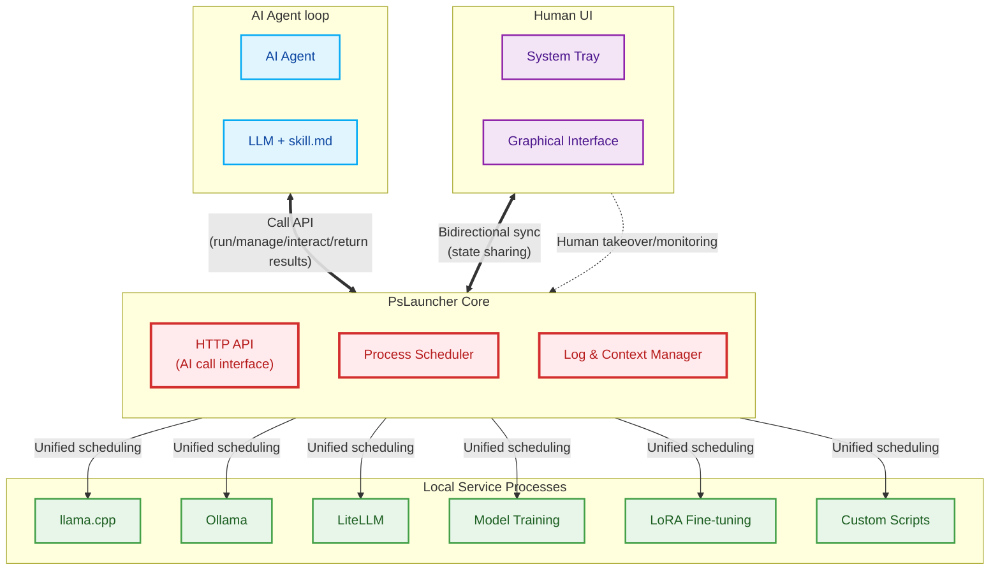

# PsLauncher — Lightweight Script Orchestrator for Local LLM Scenarios

Unify and manage PowerShell / Bash / Batch scripts in a lightweight VSCode-like interface, while embedding a built-in HTTP API service. This allows **both humans and AI Agents to operate the same local service process with a unified set of asynchronous, non‑blocking semantics**: start, interact, force‑kill, query output, and batch recycle. Supports system tray persistence, process‑tree force‑kill, ANSI‑colored terminal, and interactive I/O. Optimized for local LLM deployment stacks such as llama.cpp / Ollama / litellm. Compatible with Windows, Linux, and macOS.

<center><a href='./README.md'>English version</a> | <a href='./README_CN.md'>中文说明书</a></center>

> The English version readme is provided by machine translation and may be inaccurate.


<center>Fig. PsLauncher in action</center>

## Key Highlights

- **AI is no longer blocked by program processes** – while a program runs inside the terminal, the AI can freely inspect logs or perform other operations at any time. Manage multiple programs’ I/O simultaneously, completely decoupling the interaction timing between programs and AI.
- **Bidirectional control from the same source for human and machine** – breaks the isolation between AI Agents and human operations. Machine‑issued instructions and human GUI operations share the same state, eliminating state conflicts and handover barriers. Truly enables AI execution with human takeover at any time.
- **Unified governance of heterogeneous scripts** – ends the fragmented, inconsistent startup logic scattered across different directories and languages in the local LLM ecosystem. Converge them into a single scheduling perspective, greatly reducing the cognitive load of environment maintenance.
- **Deterministic resource reclamation** – directly tackles the persistent issues of zombie processes and GPU memory leaks. Provides a thorough cleanup capability from graceful termination to process‑tree force‑kill, ensuring stable release of hardware resources when switching between services. No extra CPU / memory / GPU overhead.
- **Dynamic long‑running task management with full lifecycle closure** – elevates traditional terminals from one‑shot sessions to visual task containers. Supports viewing historical output and injecting new commands on the fly while a task is still running, perfectly suiting AI‑orchestrated long‑running workflows and interactive scripts. No fear that a stuck program will break the agent loop.
- **Seamless switching across all deployment forms** – caters to both low‑profile desktop development and headless server backend hosting with the same system, eliminating experience fragmentation across different environments.


```mermaid
flowchart TB
    %% Node styles
    classDef agentNode fill:#e1f5fe,stroke:#03a9f4,stroke-width:2px,color:#0d47a1;
    classDef plNode fill:#fff8e1,stroke:#ffa000,stroke-width:2px,color:#e65100;
    classDef svcNode fill:#e8f5e9,stroke:#43a047,stroke-width:2px,color:#1b5e20;
    classDef apiNode fill:#ffebee,stroke:#d32f2f,stroke-width:3px,color:#b71c1c;
    classDef guiNode fill:#f3e5f5,stroke:#8e24aa,stroke-width:2px,color:#4a148c;

    subgraph Agent["AI Agent loop"]
        AGENT["AI Agent"]:::agentNode
        skill["LLM + skill.md"]:::agentNode
    end

    subgraph GUI["Human UI"]
        traynode["System Tray"]:::guiNode
        GUIUI["Graphical Interface"]:::guiNode
    end

    subgraph PL["PsLauncher Core"]
        direction TB
        API["HTTP API<br/>(AI call interface)"]:::apiNode
        core["Process Scheduler"]:::apiNode
        logctrl["Log & Context Manager"]:::apiNode
    end

    subgraph SVCS["Local Service Processes"]
        LLAMA["llama.cpp"]:::svcNode
        OLLAMA["Ollama"]:::svcNode
        LITELLM["LiteLLM"]:::svcNode
        TRAIN["Model Training"]:::svcNode
        LORA["LoRA Fine‑tuning"]:::svcNode
        CUSTOM["Custom Scripts"]:::svcNode
    end

    %% Core interaction
    Agent <==>|"Call API<br/>(run/manage/interact/return results)"| PL
    
    %% GUI interaction
    GUI <==>|"Bidirectional sync<br/>(state sharing)"| PL
    GUI -.->|"Human takeover/monitoring"| PL
    
    %% Service management
    PL -->|"Unified scheduling"| LLAMA
    PL -->|"Unified scheduling"| OLLAMA
    PL -->|"Unified scheduling"| LITELLM
    PL -->|"Unified scheduling"| TRAIN
    PL -->|"Unified scheduling"| LORA
    PL -->|"Unified scheduling"| CUSTOM
```

<center>Fig. PsLauncher architecture and highlights</center>

## Problems Solved

- **Fragmented environments and chaotic scheduling** – inference tools and gateway scripts are scattered across various directories. Running multiple services simultaneously leads to terminal explosion and cumbersome parameter memorisation. There is no unified control centre to eliminate the disconnect of manually navigating directories and switching contexts.
- **Resource leaks and hardware conflicts** – after abnormal exits, zombie child processes often remain, occupying CPU, memory, and GPU memory silently. This causes frequent hardware resource conflicts on next startup. There is a lack of a robust lifecycle fallback mechanism.
- **Interaction gap between AI and local environment** – large language models struggle to safely and stably control the local computing environment. Traditional shell commands are fragile and lack self‑description. Agents need a structured, introspectable interface to form a closed‑loop of “start‑monitor‑interact‑reclaim”.
- **Asynchronous issues between AI agent and program execution** – traditional harness programs block the agent loop during script execution. Synchronous blocking may be interrupted by script timeouts or hangs. A unified asynchronous interface is needed so that the agent can manage program I/O and process lifecycle without blocking.
- **Mismatch between heavy operations and lightweight needs** – managing local scripts often forces the use of heavyweight IDEs or complex container orchestration systems. For simple scheduling and background persistence, the overhead and learning cost are too high. A zero‑intrusion lightweight solution is urgently needed.

---

## Quick Start

> Note: The built‑in help documentation in PsLauncher is auto‑generated from Markdown. The Markdown or GitHub‑rendered page is correct; the in‑program help may not be fully accessible due to rendering issues. If you encounter problems, please refer to the Markdown or the [web page](https://github.com/NGC13009/PsLauncher.git).

### Installation

Two options:

- Download the source code and run with Python
- Download the compiled executable and run directly

#### Using Source Code

```Bash
git clone https://github.com/NGC13009/PsLauncher.git
cd PsLauncher
pip install -r ./requirements.txt
```

#### Windows Compiled Executable

Download the executable from the [release](https://github.com/NGC13009/PsLauncher/releases) page.

### Launch

You can double‑click the executable to start, or launch via command line (parameters only need to be specified on first run; the program saves settings automatically):

```bash
# Compiled executable
PsLauncher.exe

# Source code
python PsLauncher.py
```

### Usage

#### For Human Users (Direct Use)

1. Through the menu bar **Settings → Add Script Folder**, add the folder containing your scripts.
2. The left panel will automatically scan and display all scripts with the matching extensions. Click a script to view its source code.
3. Select a script and click **Run** (or press `F5`) to run it in a new terminal tab and see real‑time output.
4. Click **Terminate** (or `F6`) to forcefully stop the process, or click **Interrupt** (or `F7`) to send `Ctrl+C` for a graceful interruption.
A complete usage example: [How to use PsLauncher to manage local LLM service configurations and run instances](run_llama.cpp_and_litellm_by_PsLauncher.md)

#### Integrating PsLauncher into AI Agents via skill.md

You can use PsLauncher as a skill.md in your agent workflow. For example, place this README (choose the language your AI understands) in your agent’s skill folder, then start a PsLauncher instance:

```bash
# Compiled executable
PsLauncher.exe

# Without GUI
PsLauncher.exe --headless

# Or modify the config so that it automatically minimises to tray on startup (handy for humans to check status anytime).
```

Then the AI can call PsLauncher to asynchronously start/stop scripts or processes.

> - For programs, you need to write them as executable scripts so PsLauncher can manage them.
> - If you only use LLM operation, we recommend using [pslauncher_skill.md](pslauncher_skill.md) as the skill, because it contains only API endpoint descriptions.
> - If necessary, translate the `skill.md` into your preferred language. For example, the Chinese version is [pslauncher_skill_CN.md](pslauncher_skill_CN.md).
> - If humans also need to use it, we recommend this README because it includes GUI usage instructions, allowing you to get operational tips from the AI after it has read the manual.

If you have read the above and experimented with the program, and want to dive deeper, continue reading the full manual.

---

## Detailed Usage and Feature Description

The following manual contains almost all features of the program, very detailed, with no particular emphasis. It is recommended to use AI search to find features you are interested in and ask the AI to explain how to use them, rather than reading this document straight through.

### Program Interface Layout

PsLauncher adopts a VSCode‑like interface, mainly divided into the following areas:

1. **Menu Bar** – at the top of the window, all operations organised by function.
2. **Toolbar** – below the menu bar, providing quick buttons for frequently used functions; supports drag‑and‑drop to adjust position.
3. **Left File List** – Explorer, showing all script files in the added folders.
4. **Right Tab Area** – main workspace, supports multiple tabs for viewing and editing.

### Menu Bar Functions in Detail

#### System Menu

- **Save Current Configuration** (`F2`) – immediately save the current configuration to the config file.
- **Hide Window to System Tray** (`F10`) – hide the program window to the system tray and run in the background.
- **Auto‑minimise to Tray on Startup** – when checked, the program will automatically hide to the system tray each time it starts.
- **Edit Configuration File** – allows editing of all configuration options via a GUI. However, this interface is a crude auto‑generated view of all config items. Unless you cannot find a proper setting in the program, or the program does not provide a setting method, or you don’t want to manually edit the config file, you can modify settings here.

#### File Menu

- **Add Folder Path** (`F2`) – add a new script folder to the scan list.
- **Remove Selected Folder Path** (`F3`) – remove the selected folder from the scan list.

#### Edit Menu

- **Copy Selected** (`F11`) – copy the selected text in the current focus widget.
- **Paste** (`F12`) – paste clipboard content into the current focus widget.
- **Copy Entire Tab to Clipboard** – copy all text from the current tab.
- **Clear Terminal Screen** (`Ctrl+L`) – clear all displayed content in the current terminal tab, resetting the screen to blank.
- **Edit Script Source** (`F4`) – enter/exit script editing mode, supports saving changes.

#### Run Menu

- **Run Script** (`F5`) – run the currently selected script.
- **Terminate Script (Force Stop)** (`F6`) – forcefully terminate the script running in the current tab and all its child processes (process‑tree force‑kill).
- **Send Ctrl+C Interrupt** (`F7`) – send a `Ctrl+C` interrupt signal (`0x03`) to the current terminal process for a graceful interruption of the running script.

#### View Menu

- **Toggle Word Wrap** – enable/disable automatic text wrapping.
- **Syntax Highlighting Mode** – set code highlighting style:
  - Auto (automatically detect based on script type)
  - PowerShell
  - bash
  - command
  - None (no highlighting)

#### Script Management Menu

- **New Folder** – create a new subfolder under the selected folder.
- **New Script** – create a new script file in the selected folder.
- **Rename Script** – rename the selected script file.
- **Copy Script** – copy the selected script file (can be renamed).
- **Move Script** – move the script to another added folder.
- **Delete Script** – permanently delete the selected script file (bypasses Recycle Bin).

#### Tab Menu

- **Close All Source Tabs** (`F8`) – close all source code view tabs.
- **Close All Run Tabs** (`F9`) – close all terminal run tabs (will stop running processes).
- **Close All Tabs** – close all tabs, including source and terminal tabs.

#### Help Menu

- **Help** (`F1`) – open the help documentation.
- **About** – show program information and copyright.

### Toolbar Functions in Detail

Toolbar buttons are grouped by function with separators:

1. **Window Management**
   - 📌**Hide** – hide window to system tray. Tooltip: `Hide window to system tray; click the tray icon to restore.`
2. **Script Control**
   - ▶️**Run** – run the script in the currently focused tab. Tooltip: `Run the script in the currently focused tab.`
   - ⏹️**Terminate** – forcefully terminate the script in the currently focused tab (process‑tree kill). Tooltip: `Terminate the script in the currently focused tab (force‑kill process tree).`
   - ❌**Interrupt** – send `Ctrl+C` interrupt signal (`0x03`) to the current terminal process for graceful interruption. Tooltip: `Send Ctrl+C interrupt signal (0x03) to the current terminal process for graceful interruption.`
   - 🧹**Clear** – clear all content in the current terminal tab. Tooltip: `Clear all content in the current terminal tab.`
3. **Text Operations**
   - 📋**Copy** – copy the selected text to clipboard (if no text selected, copy the entire current tab content). Tooltip: `Copy selected text; if nothing selected, copy all text of the focused tab.`
   - 📤**Paste** – paste clipboard content at cursor position. Tooltip: `Paste clipboard content at cursor position.`
   - 📄**Copy All** – copy all text of the focused tab to clipboard. Tooltip: `Copy all text of the focused tab to clipboard.`
4. **Editing**
   - ✏️**Quick Edit** (💾**Save**) – enter/exit edit mode, save script changes. Tooltip: `Enter/exit edit mode, save script changes.` (changes to `Save script changes` when in edit mode)
5. **Tab Management**
   - 🗑️**Close All Source** – close all read‑only source code view tabs. Tooltip: `Close all read‑only source code view tabs.`
   - 🚫**Stop All Terminals** – close all terminal tabs, including running and finished ones. Tooltip: `Close all terminal tabs, including running and finished ones.`
   - 💥**Close All Tabs** – close all tabs, including source and terminal; if a process is running, it will be forcibly terminated. Tooltip: `Close all tabs, including source and terminal; running processes will be forcibly terminated. May cause improper exit of programs or scripts.`

### Left File List Features

The left file list (Explorer) is the main entry for script management:

1. **Single‑click**
   - Click on a **folder** – expand/collapse the folder.
   - Click on a **script** – open a new source code view tab on the right showing the script source.
2. **Double‑click**
   - Double‑click a folder to expand or collapse it.
3. **Supported file types**
   - `.ps1` (PowerShell scripts)
   - `.bat`, `.cmd` (Batch scripts)
   - `.sh` (Bash scripts)
4. **Scanning rules**
   - Only scans the root of added folders, does not recurse subdirectories.
   - Updates in real time; after adding/deleting files, refresh via the menu.

### Right‑hand Tab Area Features

The right area uses a multi‑tab design supporting two types of tabs:

#### 1. Source Code View Tab (📝 prefix)

- **View mode**: read‑only by default, displays script source code
  - Supports syntax highlighting (PowerShell / Bash / Batch)
  - Supports zoom via `Ctrl+Mouse wheel`
  - Dark theme, VSCode‑style
- **Edit mode**: enter by clicking the `✏️ Quick Edit` button
  - Background turns dark grey to indicate editing
  - Can modify script content
  - After editing, click `💾 Save` to save changes
  - Handles UTF‑8/GBK encoding automatically (though not always perfectly)

#### 2. Terminal Run Tab (🖥️ prefix)

- **ANSI colour support**: correctly displays coloured terminal output
- **Interactive input**: supports sending commands to the running process
- **Process control**:
  - Run script – shows start timestamp and script path
  - Stop script – forcefully terminates the process and all its children
  - Process end – shows end timestamp

### Terminal Interactive Operation Guide

Terminal tabs provide an interactive experience similar to a real terminal:

#### Keyboard Operations

- **`Enter/Return`** – send the current input line to the process.
- **`Ctrl+C`** – handled globally by the event filter: if text is selected, copy to clipboard; otherwise triggers global copy (copy entire tab) or passes to the focused widget. It no longer directly terminates the process.
- **`Ctrl+X`** – cut selected text from the focused widget.
- **`Ctrl+Z`** – undo for the focused QTextEdit widget.
- **`Ctrl+Y`** – redo for the focused QTextEdit widget.
- **`Ctrl+V`** – paste clipboard content to the input area (not sent to the process).
- **`Backspace/Left Arrow`** – restricted to deletion/navigation within the input area; cannot modify historical output.

#### Input Protection

- Input area and historical output area are separated.
- Users can only edit the current input line.
- Prevents accidental modification of already output history.
- To copy output, use the toolbar `Copy` button.

#### Process Management

- **Start process** – runs the script in a new tab, automatically invoking the appropriate interpreter based on file type.
- **Terminate process** – forcefully terminates the process tree to ensure no residual processes.
- **Process status** – displays real‑time stdout and stderr.
- **Exception handling** – shows appropriate prompts on abnormal process exit.

### Context Menus

Both the left file tree and right tabs support context menus.

#### File Tree Context Menu

**Folder context menu:**

- **📂 Open in File Explorer** – open the folder in the system file manager.
- **📂 Remove Folder Path** – remove the folder from the scan list (with confirmation dialog).
- **📂 Add Folder Path** – add a new script folder.

**Script file context menu:**

- **▶️ Run** – run the selected script directly.
- **✏️ Edit/Save** – open the script source and enter edit mode.
- **🔄 Run on Startup / 🔄 Cancel Run on Startup** – mark the script to run automatically on PsLauncher startup (only shown for runnable extensions `.ps1`/`.bat`/`.sh`). When marked, the script will be highlighted in blue in the file tree, and the tooltip will indicate `Run on Startup`.
- **💻 Edit with VSC** – attempts to open the selected file with VSCode (`code` command). If VSCode is not installed or not in PATH, a friendly error message is shown.
- **📝 Rename** – rename the selected script.
- **📋 Copy** – copy the selected script.
- **🚚 Move** – move the script to another folder.

#### Auto‑Run on Startup

For scripts that need to start with the program (e.g., local service processes), you can configure them as follows:

1. Right‑click the target script in the file tree and select **🔄 Run on Startup**.
2. The script will be highlighted in blue for easy identification.
3. The next time PsLauncher starts, that script will automatically run in a terminal tab.
4. To cancel, right‑click and select **🔄 Cancel Run on Startup**.

Combined with **Auto‑minimise to Tray on Startup**, you can achieve completely silent background service management that starts with the system.

### System Tray Features

#### Tray Icon Actions

- **Single‑click** – restore the program window.
- **Right‑click** – show the tray menu.

#### Tray Menu

- **Open Window** – restore the program from tray.
- **Exit Program** – safely exit the program (will attempt to stop all running scripts first).

#### Tray Notifications

- A prompt appears when hiding to tray.
- Program status changes can be perceived via the tray icon.

### Keyboard Shortcuts Summary

| Shortcut | Function | Description |
| -------- | -------- | ----------- |
| `F1` | Help | Show help documentation |
| `F2` | Add Folder Path | Add a new script folder |
| `F3` | Remove Folder Path | Remove the selected folder |
| `F4` | Edit/Save Script | Toggle edit mode or save changes |
| `F5` | Run Script | Run the currently selected script |
| `F6` | Terminate Script (Force) | Forcefully terminate the currently running script and all its child processes (process‑tree kill) |
| `F7` | Send `Ctrl+C` Interrupt | Send `Ctrl+C` interrupt signal (`0x03`) to the current terminal process for graceful interruption |
| `F8` | Close All Source Tabs | Close all source code view tabs |
| `F9` | Close All Run Tabs | Close all terminal run tabs |
| `F10` | Hide to System Tray | Minimise to tray |
| `F11` | Copy Selected | Copy selected text |
| `F12` | Paste | Paste clipboard content |
| `Ctrl+C` | Copy / Global handling | If text selected, copy; otherwise trigger global copy (copy entire tab) or pass to focus widget |
| `Ctrl+V` | Paste | Paste clipboard content into the current focus widget |
| `Ctrl+X` | Cut | Cut selected text from the current focus widget |
| `Ctrl+Z` | Undo | Undo for the current QTextEdit widget |
| `Ctrl+Y` | Redo | Redo for the current QTextEdit widget |
| `Ctrl+L` | Clear Terminal Screen | Clear all content in the current terminal tab |

### Configuration File

Most configuration can be done through the program interface, but you can also manually edit the config file.

The default config file path is `config.json` (in the program root, auto‑generated on first run). Supports JSON with comments:

```json
// PsLauncher configuration file
{
    "folders": [  // List of folder paths to scan for scripts
        "E:/project_file/limitless/PsLauncher/test_script"
    ],
    "font_scale": 1.5,  // Font size scaling factor (e.g., 1.5 = 150%)
    "dark_mode": true,  // Enable dark theme
    "height_value": 1080,  // Window height in pixels
    "width_value": 1920,  // Window width in pixels
    "font_family": "Consolas",  // Font family for editor and terminal
    "line_wrap_mode": false,  // Enable automatic line wrap
    "supported_extensions": [  // File extensions shown in the script tree
        ".ps1",
        ".bat",
        ".sh",
        ".json",
        ".yaml"
    ],
    "runnable_extensions": [  // File extensions that can be executed
        ".ps1",
        ".bat",
        ".sh"
    ],
    "syntax_highlight_mode": "auto",  // Syntax highlighting mode: auto, ps1, bash, command, none
    "auto_run_scripts": [],  // List of script paths to auto‑run on startup
    "auto_minimize_to_tray": false,  // Auto‑minimise to system tray on startup
    "language": "zh_CN",  // UI language code (e.g., en, zh_CN)
    "api": {  // HTTP API server configuration
        "enabled": true,  // Enable HTTP API server
        "bind_ip": "127.0.0.1",  // IP address to bind (127.0.0.1 = localhost only)
        "bind_port": 13025,  // Port number
        "auth_token": ""  // Bearer token for authentication (empty = no auth)
    }
}
```

### Example Workflow

#### Initial Setup

1. Launch the program.
2. Click `File` → `Add Folder Path` or press `F2`.
3. Select the folder containing your scripts (e.g., llama.cpp directory).
4. The program automatically scans for script files in that folder.

#### View and Edit Scripts

1. Click a script file in the left file list.
2. A source code view tab opens on the right showing the code.
3. To modify, click the `✏️ Quick Edit` button to enter edit mode.
4. After editing, click `💾 Save` to save changes.

#### Run a Script

1. Click a script file in the left file list.
2. Click the `▶️ Run` button on the toolbar or press `F5`.
3. A terminal tab opens on the right and the script runs.
4. View real‑time output and perform interactive input as needed.
5. To force stop, click `⏹️ Terminate` or press `F6` (process‑tree kill); for graceful interruption, click `❌ Interrupt` or press `F7` (send `Ctrl+C`).

#### Multi‑task Management

- You can open multiple scripts for viewing simultaneously.
- You can run multiple scripts in different tabs concurrently.
- Scroll the tab bar with the mouse wheel to switch tabs.
- Use tab management functions to batch‑close tabs.

#### Background Operation

1. Click the `📌 Hide` button on the toolbar or press `F10`.
2. The window hides to the system tray.
3. Scripts continue running in the background.
4. Click the tray icon to restore the window at any time.

### Command‑Line Arguments

```bash
usage: PsLauncher.py [-h] [--scale SCALE] [--light] [--dark] [--font FONT] [--height HEIGHT] [--width WIDTH]

PsLauncher - Universal Script Launcher

options:
  -h, --help        show this help message
  --scale SCALE     set window DPI scaling factor, e.g., 1.5
  --light           set light theme
  --dark            set dark theme
  --font FONT       set font, e.g., 'Consolas'
  --height HEIGHT   window height, e.g., 768
  --width WIDTH     window width, e.g., 1366
  --headless        headless mode, no GUI window, only HTTP API
```

### HTTP API Server

PsLauncher exposes an HTTP API server on `127.0.0.1:13025` by default. Any LLM or human can send POST/GET requests to operate PsLauncher functions, equivalent to performing operations via the GUI.

#### Headless Mode

Start PsLauncher with `--headless` to run without the GUI, serving only via HTTP API:

```bash
python PsLauncher.py --headless
```

#### API Configuration

Configure API parameters in `launcher_config.json`:

```json
{
    // ...other settings...
    "api": {
        "enabled": true,           // Enable API server (false disables on next start)
        "bind_ip": "127.0.0.1",    // Bind IP (127.0.0.1 does not respond to public requests)
        "bind_port": 13025,        // Bind port
        "auth_token": ""           // Bearer Token (empty = no authentication)
    }
}
```

#### Authentication

If `auth_token` is set, all requests must carry the Authorization header:

```text
Authorization: Bearer <your-token>
```

Incorrect tokens return `401 Unauthorized`.

**Pretty output**: All endpoints support the `?pretty=true` query parameter to return formatted JSON (with indentation and newlines), making it human‑readable. Without `pretty`, the default is compact format with backslash escapes for control characters, suitable for programmatic parsing.

#### API Endpoints

All endpoints support POST; most query endpoints also support GET.

| Endpoint | Description | Request Body / Parameters |
| --- | --- | --- |
| `GET/POST /status` | Check status | None |
| `GET /help` | Show help information (HTML format) | None |
| `POST /help` | Get list of all available API endpoint formats (request body structure reference) | None |
| `GET/POST /folders` | List folder paths | None |
| `GET/POST /scripts` | List scripts | `?folder=<path>` (optional) |
| `POST /folder/add` | Add a folder path | `{"path":"C:/scripts"}` |
| `POST /folder/remove` | Remove a folder path | `{"path":"C:/scripts"}` |
| `POST /script/run` | Run a script | `{"folder":"C:/scripts","script":"test0.ps1"}` |
| `GET/POST /terminals` | List terminal tabs (with IDs) | None |
| `POST /terminal/stop` | Stop a terminal | `{"id":0}` or `{"name":"test0.ps1"}` |
| `POST /terminal/stop_all` | Stop all terminals | No parameters |
| `GET/POST /terminal/output` | View terminal output | `?id=0` or `?name=test0.ps1` |
| `POST /terminal/clear` | Clear terminal output | `{"id":0}` |
| `POST /terminal/input` | Send a string to terminal | `{"id":0,"text":"hello\n"}` |
| `GET/POST /shutdown` | Shut down PsLauncher | No parameters |

#### Usage Examples (Complete Walkthrough)

All examples assume PsLauncher is already running, and replace `E:\\project_file\\limitless\\PsLauncher\\test_script` with the **absolute path** to your `test_script` folder.

The repository includes several test scripts that can be used directly. (You may need to download the source code, as the release version does not include test scripts.)

> **PowerShell note**: PowerShell parses arguments differently from CMD. We recommend using `--%` (stop parsing symbol). All examples below use the `--%` syntax with backslash path separators and escaping. These examples have been tested on Windows 11 with PowerShell.

- Check service status

```powershell
curl.exe http://127.0.0.1:13025/status
```

Expected output:

```jsonc
{"status": "ok", "version": "v2.0.1", "app": "PsLauncher"}
```

- Get all available API endpoint formats (pretty formatted)

```powershell
curl.exe -X POST http://127.0.0.1:13025/help?pretty=true
```

Expected output:

```jsonc
{
  "success": true,
  "endpoints": [
    {
      "method": "GET",
      "path": "/status",
      "description": "Check server status",
      "params": null,
      "body": null,
      "response": {
        "status": "ok",
        "version": "x.x.x",
        "app": "PsLauncher"
      }
    },
    ..... // many lines omitted
  ]
}
```

- Add test_script folder to scan list

```powershell
curl.exe --% -X POST http://127.0.0.1:13025/folder/add -H "Content-Type: application/json" -d "{\"path\":\"E:\\project_file\\limitless\\PsLauncher\\test_script\"}"
```

Expected output:

```jsonc
{"success": true, "message": "Added folder: E:\\project_file\\limitless\\PsLauncher\\test_script"}
```

- List all runnable scripts

```powershell
curl.exe http://127.0.0.1:13025/scripts
```

Expected output:

```jsonc
{"scripts": [{"folder": "E:/project_file/limitless/PsLauncher/test_script", "name": "test0.ps1", ...}....}
```

- Run test0.ps1 (basic output + show working directory)

> test0.ps1 content: prints three lines, then displays the current working directory.

```powershell
curl.exe --% -X POST http://127.0.0.1:13025/script/run -H "Content-Type: application/json" -d "{\"folder\":\"E:\\project_file\\limitless\\PsLauncher\\test_script\",\"script\":\"test0.ps1\"}"
```

Expected output:

```jsonc
{"success": true, "terminal_id": 0, "message": "Started script: test0.ps1"}
```

At the same time, the PsLauncher GUI launches the script.

- List terminals (record the ID)

```powershell
curl.exe http://127.0.0.1:13025/terminals
```

Expected output:

```jsonc
{"terminals": [{"id": 0, "name": "test0.ps1", "script": "E:\\project_file\\limitless\\PsLauncher\\test_script\\test0.ps1", "running": false}]}
```

- View terminal output (id=0 from the previous test0.ps1)

```powershell
curl.exe "http://127.0.0.1:13025/terminal/output?id=0"
```

Expected output:

```jsonc
{"success": true, "id": 0, "name": "test0.ps1", "output": "[PsLauncher 2026-06-30 21:40:20] start: E:\\project_file\\limitless\\PsLauncher\\test_script\\test0.ps1\ntest0-1\ntest0-2\ntest0-3\nCurrent work path: E:\\project_file\\limitless\\PsLauncher\\test_script\n\n[PsLauncher 2026-06-30 21:40:20] Process terminated.\n"}
```

- Run test2.ps1 (interactive input demo)

> test2.ps1 content: prints three lines, then waits for keyboard input via Read‑Host.

```powershell
curl.exe --% -X POST http://127.0.0.1:13025/script/run -H "Content-Type: application/json" -d "{\"folder\":\"E:\\project_file\\limitless\\PsLauncher\\test_script\",\"script\":\"test2.ps1\"}"
```

Expected output:

```jsonc
{"success": true, "terminal_id": 1, "message": "Started script: test2.ps1"}
```

- List terminals again (should now have id=0 and id=1)

```powershell
curl.exe http://127.0.0.1:13025/terminals
```

Expected output:

```jsonc
{"terminals": [{"id": 0, "name": "test0.ps1", "script": "E:\\project_file\\limitless\\PsLauncher\\test_script\\test0.ps1", "running": false}, {"id": 1, "name": "test2.ps1", "script": "E:\\project_file\\limitless\\PsLauncher\\test_script\\test2.ps1", "running": true}]}
```

- Send input to id=1 (test2.ps1)

```powershell
curl.exe --% -X POST http://127.0.0.1:13025/terminal/input -H "Content-Type: application/json" -d "{\"id\":1,\"text\":\"Hello PsLauncher\"}"
```

Expected output:

```jsonc
{"success": true, "message": "Sent input to terminal ID=1"}
```

- View test2.ps1 output (should include the input just sent)

```powershell
curl.exe "http://127.0.0.1:13025/terminal/output?id=1"
```

Expected output:

```jsonc
{"success": true, "id": 1, "name": "test2.ps1", "output": "[PsLauncher 2026-06-30 21:41:29] start: E:\\project_file\\limitless\\PsLauncher\\test_script\\test2.ps1\ntest2-1\ntest2-2\ntest2-3\nHello PsLauncher\nYou entered: Hello PsLauncher\n\n[PsLauncher 2026-06-30 21:41:44] Process terminated.\n"}
```

- Run test3.bat (batch script demo)

```powershell
curl.exe --% -X POST http://127.0.0.1:13025/script/run -H "Content-Type: application/json" -d "{\"folder\":\"E:\\project_file\\limitless\\PsLauncher\\test_script\",\"script\":\"test3.bat\"}"
```

Expected output:

```jsonc
{"success": true, "terminal_id": 2, "message": "Started script: test3.bat"}
```

- View test3.bat output

```powershell
curl.exe "http://127.0.0.1:13025/terminal/output?id=2"
```

Expected output:

```jsonc
{"success": true, "id": 2, "name": "test3.bat", "output": "[PsLauncher 2026-06-30 21:41:55] start: E:\\project_file\\limitless\\PsLauncher\\test_script\\test3.bat\nbat test3-1\nbat test3-2\nbat test3-3\n\n[PsLauncher 2026-06-30 21:41:55] Process terminated.\n"}
```

- Clear test3.bat terminal output

```powershell
curl.exe --% -X POST http://127.0.0.1:13025/terminal/clear -H "Content-Type: application/json" -d "{\"id\":2}"
```

Expected output:

```jsonc
{"success": true, "message": "Cleared output of terminal ID=2"}
```

- Stop terminal id=1 (test2.ps1)

```powershell
curl.exe --% -X POST http://127.0.0.1:13025/terminal/stop -H "Content-Type: application/json" -d "{\"id\":1}"
```

Expected output:

```jsonc
{"success": true, "message": "Stopped terminal ID=1"}
```

- Stop all terminals

```powershell
curl.exe --% -X POST http://127.0.0.1:13025/terminal/stop_all
```

Expected output:

```jsonc
{"success": true, "message": "Stopped 2 terminals"}
```

- Shut down PsLauncher

```powershell
curl.exe --% -X POST http://127.0.0.1:13025/shutdown
```

Expected output:

```jsonc
{"success": true, "message": "PsLauncher is shutting down..."}
```

> At the same time, PsLauncher exits.

### Using Pretty Output (Human‑Readable)

Add `?pretty=true` to make the output human‑readable.

- With `?pretty=true`:

```powershell
curl.exe "http://127.0.0.1:13025/status?pretty=true"
```

Expected output:

```jsonc
{
  "status": "ok",
  "version": "v2.0.1",
  "app": "PsLauncher"
}
```

- Without `?pretty=true`:

```powershell
curl.exe "http://127.0.0.1:13025/status"
```

Expected output:

```jsonc
{"status": "ok", "version": "v2.0.1", "app": "PsLauncher"}
```

### Notes

- If running from source, ensure Python 3.x and Qt5/Qt6 are installed.
- In some cases, administrator privileges may be required (depending on script content).
- (Known issue) Terminal colour rendering may be incorrect in some cases.
- (Known issue) The editor background colour should change to indicate edit mode, but sometimes this visual cue does not appear.

### Frequently Asked Questions

**Q: How to copy terminal output?**
A: Use the `📋 Copy` button to copy selected text (or press `Ctrl+C` directly), or use `📄 Copy All` to copy the entire tab content. `Ctrl+C` is now handled globally: if text is selected, it copies; otherwise it copies the entire tab content.

**Q: What if save fails in edit mode?**
A: It may be a file permission issue. Try running the program as administrator, or check if the file is locked by another program.

**Q: How to adjust interface font size?**
A: Start the program with the `--scale` command‑line parameter, or modify the `font_scale` value in the configuration file.

**Q: No output after running a script?**
A: Check if the script requires interactive input. The terminal supports interactive operation – try typing a command in the input area and pressing `Enter`.

**Q: How to permanently delete a script file?**
A: Use `Script Management` → `Delete Script`. Note that this deletes the file directly, bypassing the Recycle Bin.

## Development Information & Notes for Developers

- **Language**: Python 3.12+
- **GUI Framework**: PyQt5 / PyQt6 / PySide6

### Build Process

First ensure the environment: besides `requirements.txt`, you also need `pip install pyinstaller`.

Then run:

```bash
pyinstaller -w ./PsLauncher.py -i ./logo.ico -y --distpath ./exe  --paths ./
```

The program has only one media asset (the icon), which has been base64‑encoded into the source code, so no additional resource configuration is needed – just build directly.

### Release Procedure

The proper release procedure is as follows:

1. Update `__version__` and `__devdate__` in `aboutandhelp.py`.
2. Run `python check_i18n_coverage.py` to verify i18n coverage.
3. Run `python get_help_page.py` to compile multi‑language help pages (reads `README.md` for English, `README_CN.md` for Chinese, etc.)
4. If the icon is updated, run `python get_ico.py` to recompile it.
5. Run `pyinstaller -w ./PsLauncher.py -i ./logo.ico -y --distpath ./exe  --paths ./` to build.
6. If necessary, also place the help documents.
7. Run `get_zip_release.ps1` to package.

Correct release directory structure:

```PowerShell
exe/
   PsLauncher.exe
   _internal/*    # Required dynamic libraries
```

### Internationalisation (i18n)

This program uses a custom i18n module for multi‑language support. You can check the code in the `i18n` folder to understand its simple mechanism.

### Automated Testing

The project has a complete automated testing suite based on `pytest` + `pytest-qt` + `pytest-xdist`, supporting headless parallel execution.

#### Test Directory Structure

```text
test/
├── conftest.py              # Global fixtures: environment variables, temp config, main_window, etc.
├── test_config.py           # Functional: config.json read/write, defaults, comment parsing, boundary values
├── test_scanner.py          # Functional: folder scanning, non‑recursive, suffix filtering, real‑time refresh
├── test_script_types.py     # Algorithmic: .ps1/.bat/.sh detection, interpreter selection, extension validation
├── test_process_control.py  # Functional: process‑tree force‑kill, Ctrl+C signal (0x03), no leftover children
├── test_ansi.py             # Algorithmic: ANSI escape parsing and colouring
├── test_syntax_highlight.py # Algorithmic: auto/ps1/bash/command/none mode discrimination
├── test_i18n.py             # Algorithmic: i18n module pure functions
├── test_utils.py            # Algorithmic: utility functions (theme, font scaling)
├── test_autorun.py          # Functional: auto‑run on startup flag, blue highlight state persistence
├── test_tray.py             # GUI: tray hide/restore/exit (skipped under offscreen)
├── test_gui_main.py         # GUI: main window construction, menu Action triggers, tab add/delete
├── test_gui_toolbar.py      # GUI: toolbar button mappings
├── test_gui_terminal.py     # GUI: terminal tab ANSI rendering, interactive input
├── test_gui_editor.py       # GUI: source tab read‑only/edit toggle, save, zoom
├── test_gui_tabs.py         # GUI: batch tab closing, F8/F9 shortcuts
└── fixtures/
    ├── __init__.py
    ├── config_factory.py    # Build different config.json scenarios
    └── temp_scripts.py      # Temporary script directory
```

#### Three‑Tier Test Classification

| Tier | Description | Parallel‑safe | Marker |
|------|-------------|---------------|--------|
| **Algorithmic (algo)** | Pure functions, no Qt dependency | ✅ Safe | `@pytest.mark.algo` |
| **Functional (func)** | Business logic without QWidget instantiation (mockable) | ✅ Safe | `@pytest.mark.func` |
| **GUI (gui)** | Interactive tests based on pytest‑qt, require qtbot fixture | ⚠️ Use with caution | `@pytest.mark.gui` |

#### Running Tests

**Minimal version** (uniform for CI and local):

```bash
python -m pytest test/ -q --tb=short -p no:warnings --no-header
```

**Detailed version** (local debugging):

```bash
python -m pytest test/ -q --tb=long -p no:warnings
```

**Only non‑GUI tests** (fast regression):

```bash
python -m pytest test/ -q --tb=short -p no:warnings --no-header -m "not gui"
```

Parameter meanings:

- `-q`/`--no-header`: concise output, saves tokens. If you are human, `-v` might be more suitable.
- `--tb=short`: short traceback, avoids excessive stack dumps.
- `-p no:warnings`: suppress Python warnings.
- `-n auto`: enable pytest‑xdist parallelisation across CPU cores.
- `-m "not gui"`: skip GUI‑marked tests.

#### Headless Environment Requirements

pytest‑qt requires the following when running in a headless environment (CI/server):

```bash
export QT_QPA_PLATFORM=offscreen   # Linux/macOS
set QT_QPA_PLATFORM=offscreen      # Windows CMD
$env:QT_QPA_PLATFORM="offscreen"   # Windows PowerShell
```

This is already set automatically at the top of `conftest.py`. To specify a Qt binding:

```bash
export PYTEST_QT_API=pyqt5
```

#### Notes for AI Agents

- After writing test code, AI should only run `py_compile` or the pytest suite. **AI must not execute GUI‑only tests themselves** (they will block the agent loop). Any GUI‑only tests should be run and confirmed by a human assistant.
- Do not read files starting with `source_` (e.g., `source_ico.py`) – these are auto‑generated by the compiler and are very large.
- GUI tests have limited coverage in offscreen mode; tray and drag‑and‑drop features require manual verification.
- After development, you must run `python -m pytest test/ -q --tb=long -p no:warnings` to confirm all tests pass.

#### Checklist for Human Developers (Test Coverage)

Below is a checklist with automation status:

| Item | Automated Status |
|------|------------------|
| Normal startup | ✅ `test_gui_main.py` |
| Menu bar functions work correctly | ✅ `test_gui_main.py::TestMenuActions` |
| Toolbar functions work correctly | ✅ `test_gui_toolbar.py` |
| Toolbar dragging keeps correct position | ⚠️ Drag requires manual confirmation |
| File explorer displays correctly | ✅ `test_scanner.py` |
| File explorer context menu functions | ⚠️ Context menu trigger requires manual confirmation |
| Source code tab works correctly | ✅ `test_gui_editor.py` |
| Source code tab editing and saving | ✅ `test_gui_editor.py` |
| Multiple source tabs switching | ✅ `test_gui_main.py::TestTabManagement` |
| Terminal tab works correctly | ✅ `test_gui_terminal.py` |
| Terminal interactive input | ✅ `test_gui_terminal.py` |
| Terminal interrupt function | ✅ `test_process_control.py` |
| Child process exits when tab closed | ✅ `test_process_control.py` |
| Child processes exit on bulk tab close | ✅ `test_gui_tabs.py` |
| Child processes exit when program exits | ✅ `test_process_control.py` |
| Multiple child processes do not interfere | ⚠️ Manual verification of process isolation |
| Tray hide/restore | ⚠️ Skipped under offscreen, manual confirmation needed |
| Tray exit leaves no residues | ⚠️ Manual confirmation needed |
| Scripts run from the script’s folder | ✅ `test_process_control.py` |

**AI automated coverage:** 23 items ✅ / 5 items ⚠️ require human verification.

## Notes for Human Developers

As a human, you are obliged to assist the AI in executing GUI functional tests. Please check the following checklist whenever necessary (e.g., if you have changed the corresponding code). The list is for reference; feel free to add new items as needed:

- [x] Normal startup
- [x] Change interface scaling via JSON config
- [x] Menu bar functions work correctly
- [x] Toolbar functions work correctly
- [x] Toolbar drag‑and‑drop positioning works
- [x] File explorer displays correctly
- [x] File explorer context menu functions work correctly
- [x] File explorer: copy, new, delete, etc.
- [x] Source code tabs work correctly
- [x] Source code tab context menu
- [x] Source code tab editing, saving, etc.
- [x] Multiple source code tab switching
- [x] Terminal tabs work correctly
- [x] Terminal tab context menu
- [x] Terminal tab editing, saving, etc.
- [x] Multiple terminal tab switching
- [x] Terminal interactive input
- [x] Terminal interrupt function
- [x] Terminal: child process exits when tab is closed
- [x] Terminal: child processes exit when bulk closing tabs
- [x] Terminal: child processes exit when the entire program exits
- [x] Terminal: multiple child processes do not interfere with each other
- [x] Tray: can hide
- [x] Tray: can restore
- [x] Tray: tooltip works
- [x] Tray: can exit without leftover child processes
- [x] Terminal: scripts run from their own directory when started

Remember to restore the checkboxes after verification!

## Copyright Information

NGC13009

[NGC13009/PsLauncher](https://github.com/NGC13009/PsLauncher.git)

Licensed under GPLv3.
