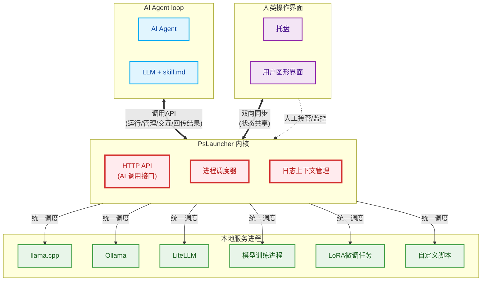

# PsLauncher — 面向本地 LLM 场景的轻量脚本编排器

在一个类 VSCode 的轻量界面中统一管理并运行 PowerShell / Bash / Batch 脚本，同时内置一套 HTTP API 服务，**让人与 AI Agent 能以同一套语义异步的，非阻塞的操作统一管理的本地服务进程**：启动、交互、强杀、查输出、批量回收。支持系统托盘常驻、子进程树强杀、ANSI 着色终端与交互式输入输出，专为 llama.cpp / Ollama / litellm 等本地大模型部署场景优化。兼容Windows，Linux，macos等。

<center><a href='./README_CN.md'>中文说明书</a> | <a href='./README.md'>English version</a></center>


<center>图. PsLauncher的运行状态展示</center>

## 核心亮点

- **ai不再因为程序进程而阻塞**：当程序执行在终端内的时候，ai仍旧可以选择随时查看日志或进行其他操作。同时管理多个程序的输入输出，彻底解耦程序和ai的交互时序问题。
- **人机同源的双向控制**：打破AI Agent与人类操作的隔离墙，机器的指令与人工的图形界面操作共享同一状态，消除人机双轨制带来的状态冲突与接管壁垒，真正实现AI执行、人可接管。
- **异构脚本的统一治理**：终结本地大模型生态中各类推理脚本分散、异构的混乱局面，将不同目录、不同语言的启动逻辑收敛为单一调度视角，大幅降低环境维护的心智负担。
- **计算资源的确定性回收**：直击僵尸进程与显存泄漏的顽疾，提供从优雅终止到进程树强杀的彻底回收能力，保障硬件资源在多服务切换中的稳定释放。不再产生cpu/内存/GPU的额外占用。
- **长任务的动态托管闭环**：将传统终端从一次性升级为可视化任务容器，支持在任务运行期间随时查阅历史轨迹并动态注入新指令，完美适配AI长时编排与交互式脚本的运行诉求。无惧程序卡死导致agent loop被打断。
- **全场景形态的无缝切换**：兼顾桌面开发的低打扰常驻需求与无头服务器的纯后端托管诉求，以同一套系统消除不同部署环境下的体验割裂。



<center>图. PsLauncher的架构原理与亮点技术</center>

## 解决的痛点

- **环境碎片化与调度混乱**：各类推理工具与网关的脚本散落在不同角落，多服务并行时面临终端窗口爆炸、参数记忆繁琐等问题。缺乏一个统一的控制中枢来消除手动穿梭目录与环境切换的割裂感。
- **资源泄漏与硬件冲突**：异常退出后常遗留难以清理的僵尸子进程，导致处理器/内存/显存被隐性占用，下一次启动时频发硬件资源冲突，缺乏强有力的生命周期兜底机制。
- **AI与本地环境的交互鸿沟**：大模型难以稳定、安全地操控本地计算环境。传统的Shell命令脆弱且缺乏自描述性，Agent亟需一种结构化、可自省的接口来形成"启动-监控-交互-回收"的闭环控制。
- **AI agent和程序执行的异步问题**：传统harness程序的agent loop会被程序或脚本执行打断，同步式的阻塞处理可能因脚本超时或者脚本停止执行而中断，因此需要使用更为统一的异步访问接口的令agent处理程序或脚本的输入输出，统一管控进程生命周期。
- **重运维与轻需求的错位**：管理本地脚本往往被迫引入重量级IDE或复杂的容器编排系统，对于仅需简单调度与后台常驻的需求而言，系统开销与学习成本过高，亟需一种零侵入的轻量化方案。

---

## 快速开始

> 注意：PsLauncher程序内的帮助文档由Markdown自动生成, 因此Markdown文档或GitHub网页渲染的是正确的, 程序内自带的说明文档不一定是完全可正常访问的. 如果存在渲染问题，请以Markdown或[网页说明](https://github.com/NGC13009/PsLauncher.git)为准.

### 安装

两种方式:

- 下载源代码并使用Python运行
- 下载编译好的exe并直接运行

#### 源码使用

```Bash
git clone https://github.com/NGC13009/PsLauncher.git
cd PsLauncher
pip install -r ./requirements.txt
```

#### Windows编译好的exe

从[release](https://github.com/NGC13009/PsLauncher/releases)页面下载exe。

### 启动

可直接双击 exe 启动，或通过命令行启动（参数仅首次需指定，程序会自动保存配置）：

```bash
# 编译后exe启动
PsLauncher.exe

# 源码启动
python PsLauncher.py
```

### 使用

#### 对于人类用户的直接使用方式

1. 通过菜单栏「设置 → 添加脚本目录」，添加你的脚本存放文件夹
2. 左侧列表会自动扫描并展示目录下匹配指定后缀的所有脚本，单击脚本即可查看源码
3. 选中脚本后点击「启动」（或按 `F5`），即可在新标签页运行脚本，查看实时输出
4. 点击「终止」（或按 `F6`）强制停止进程，点击「中断」（或按 `F7`）发送 `Ctrl+C` 优雅中断
一个完整使用案例：[如何使用 PsLauncher 自定义的管控本地大模型服务配置，运行实例等](run_llama.cpp_and_litellm_by_PsLauncher.md)

#### 通过 skill 向 AI AGENT 接入 PsLauncher

你可以将PsLauncher作为skill.md接入你的agent工作流。例如，将本README.md（考虑您的ai能看懂的语言版本）放置于 AI AGENT 的skill文件夹内，然后启动一个PsLauncher实例：

```bash
# 编译后exe启动
PsLauncher.exe

# 不启动GUI
PsLauncher.exe  --headless

# 或者修改配置文件，令启动时自动最小化到托盘（这同时方便人类随时查看状态）。
```

之后ai即可调用 PsLauncher 进行异步的脚本或进程的启停管控。

> - 对于程序，需要写成执行指令的脚本，以使用PsLauncher进行管理。
> - 如果只使用LLM操作，那推荐使用[pslauncher_skill.md](pslauncher_skill.md)来作为技能，因为这个文件仅包含api端点调用的说明。
> - 如果需要人类同时使用，那推荐使用本README，因为它还包括了GUI使用说明，这能让你和ai聊天的时候获得来自于ai看过说明书学会的操作提示。

如果上面的内容看完后，加上程序摸索了一遍，想进一步探索，请继续阅读说明书。

---

## 详细使用方法与功能说明

下面的说明书包含了几乎程序所有功能的说明，十分详细，没有重点。建议通过ai搜索自己感兴趣的功能并令ai向您解释使用方法，而非直接阅读本说明。

### 程序界面构成

PsLauncher 采用类 VSCode 的界面布局，主要分为以下几个区域：

1. **菜单栏** - 位于窗口顶部，按功能分类组织所有操作
2. **工具栏** - 菜单栏下方，提供常用功能的快捷按钮，支持拖动调整位置
3. **左侧文件列表** - 资源管理器，显示已添加文件夹中的所有脚本文件
4. **右侧标签页区域** - 主要工作区，支持多标签页切换查看和编辑

### 菜单栏功能详解

#### 系统菜单

- **保存当前配置** (`F2`) - 立即保存当前配置到配置文件
- **隐藏窗口到系统托盘** (`F10`) - 将程序窗口隐藏到系统托盘，后台运行
- **启动时自动最小化到托盘** - 勾选后，每次启动程序时自动隐藏到系统托盘
- **编辑配置文件** - 允许编辑所有配置，但是这个界面是自动展开所有配置的GUI用于用户修改，十分简陋，除非找不到程序中正规的配置项目，或者本身程序不提供设置方式，或者不想编辑配置文件，那么可以从此处修改配置项。

#### 文件菜单

- **添加文件夹路径** (`F2`) - 添加新的脚本文件夹到扫描列表
- **移除选中的文件夹路径** (`F3`) - 从扫描列表中移除选中的文件夹

#### 编辑菜单

- **复制选定内容** (`F11`) - 复制当前焦点控件中选中的文本
- **粘贴** (`F12`) - 将剪贴板内容粘贴到当前焦点控件
- **复制标签页全部到剪贴板** - 复制当前标签页全部文本内容
- **清除终端屏幕** (`Ctrl+L`) - 清除当前终端标签页的所有显示内容，重置屏幕为空白状态
- **编辑脚本源代码** (`F4`) - 进入/退出脚本编辑模式，支持保存更改

#### 运行菜单

- **启动脚本** (`F5`) - 运行当前选中的脚本
- **终止脚本（强制中止）** (`F6`) - 强制终止当前标签页中运行的脚本及其所有子进程（进程树强杀）
- **发送 Ctrl+C 中断** (`F7`) - 向当前终端进程发送 `Ctrl+C` 中断信号 (`0x03`)，用于优雅中断正在运行的脚本

#### 查看菜单

- **切换自动换行模式** - 开启/关闭文本自动换行
- **语法着色方式** - 设置代码高亮风格：
  - 自动 (根据脚本类型自动识别)
  - PowerShell
  - bash
  - command
  - 不进行着色 (关闭高亮)

#### 脚本管理菜单

- **新建路径** - 在选中文件夹下创建新文件夹
- **新建脚本** - 在选中文件夹中创建新脚本文件
- **重命名脚本** - 重命名选中的脚本文件
- **复制脚本** - 复制选中的脚本文件（可重命名）
- **移动脚本** - 将脚本移动到其他已添加的文件夹
- **删除脚本** - 永久删除选中的脚本文件（不经过回收站）

#### 标签菜单

- **关闭所有源码标签页** (`F8`) - 关闭所有源代码查看标签页
- **关闭所有运行标签页** (`F9`) - 关闭所有终端运行标签页（会停止运行中的进程）
- **关闭所有标签页** - 关闭所有标签页，包括源码和终端标签

#### 帮助菜单

- **帮助** (`F1`) - 打开帮助文档
- **关于** - 显示程序信息和版权信息

### 工具栏功能详解

工具栏按钮按功能分组，使用分隔符分隔：

1. **窗口管理组**
   - 📌**隐藏** - 隐藏窗口到系统托盘，悬浮提示：`隐藏窗口到系统托盘, 通过单击托盘图标即可恢复窗口`
2. **脚本控制组**
   - ▶️**运行** - 运行当前焦点标签页的脚本，悬浮提示：`运行当前焦点标签页的脚本`
   - ⏹️**终止** - 强制终止当前焦点标签页的脚本（进程树强杀），悬浮提示：`终止当前焦点标签页的脚本（强制终止进程树）`
   - ❌**中断** - 向当前终端进程发送 `Ctrl+C` 中断信号 (`0x03`)，用于优雅中断正在运行的脚本，悬浮提示：`向当前终端进程发送 Ctrl+C 中断信号（0x03），用于优雅中断正在运行的脚本`
   - 🧹**清屏** - 清除当前终端标签页的所有显示内容，悬浮提示：`清除当前终端标签页的所有显示内容`
3. **文本操作组**
   - 📋**复制** - 复制当前选中的文本到剪贴板（未选中文本时复制当前标签页全部内容），悬浮提示：`复制当前选中的文本到剪贴板，如果未选中任何内容则复制当前焦点页面的所有文本。`
   - 📤**粘贴** - 粘贴当前剪贴板内容到光标位置，悬浮提示：`粘贴当前剪贴板内容到光标位置`
   - 📄**复制全部** - 复制焦点标签页全部文本到剪贴板，悬浮提示：`复制焦点标签页全部文本到剪贴板`
4. **编辑功能组**
   - ✏️**快速编辑**（💾**保存**） - 进入/退出编辑模式，保存脚本更改，悬浮提示：`进入/退出编辑模式，保存脚本更改`（编辑模式时变为`保存脚本更改`）
5. **标签页管理组**
   - 🗑️**关闭所有源码** - 关闭所有只读源代码查看标签页，悬浮提示：`关闭所有只读源代码查看标签页`
   - 🚫**中止所有终端** - 关闭所有终端标签页，包括运行中的以及已经结束的，悬浮提示：`关闭所有终端标签页, 包括运行中的以及已经结束的`
   - 💥**关闭所有标签** - 关闭所有标签，这会关闭所有源代码标签页，同时关闭所有终端标签页，如果终端内正在执行，那么将强制中止，悬浮提示：`关闭所有标签, 这会关闭所有源代码标签页, 同时关闭所有终端标签页, 如果终端内正在执行, 那么将强制中止. 可能导致执行中的程序或脚本不能正常退出.`

### 左侧文件列表功能

左侧文件列表（资源管理器）是脚本管理的主要入口：

1. **单击操作**
   - 单击**文件夹项**：展开/折叠文件夹
   - 单击**脚本项**：在右侧打开一个新的源码查看标签页，显示脚本源代码

2. **双击操作**
   - 双击文件夹，可以折叠或展开文件夹的内容。

3. **文件类型支持**
   - 支持 `.ps1` (PowerShell脚本)
   - 支持 `.bat`、`.cmd` (批处理脚本)
   - 支持 `.sh` (Bash脚本)

4. **扫描规则**
   - 仅扫描已添加文件夹的根目录，不递归子目录
   - 实时更新显示，添加/删除文件后可通过刷新菜单更新

### 右侧标签页功能

右侧区域采用多标签页设计，支持两种类型的标签页：

#### 1. 源码查看标签页 (📝 前缀)

- **查看模式**：默认只读模式，显示脚本源代码
  - 支持语法高亮（PowerShell/Bash/Batch语法）
  - 支持通过 `Ctrl+鼠标滚轮` 缩放
  - 暗色主题背景，类似VSCode风格
- **编辑模式**：通过点击 `✏️快速编辑` 按钮进入
  - 背景色变为深灰色以示区别
  - 可修改脚本内容
  - 编辑完成后点击 `💾保存` 保存更改
  - 自动处理UTF-8/GBK编码 (可能也不是那么好用...)

#### 2. 终端运行标签页 (🖥️ 前缀)

- **ANSI着色支持**：正确显示彩色终端输出
- **交互式输入**：支持向运行中的进程输入命令
- **进程控制**：
  - 运行脚本：显示启动时间戳和脚本路径
  - 中止脚本：强制终止进程及其所有子进程
  - 进程结束：显示结束时间戳

### 终端交互式操作指南

终端标签页提供类似真实终端的交互体验：

#### 键盘操作

- **`Enter/Return键`**：发送当前输入行的命令给进程
- **`Ctrl+C`**：由全局事件过滤器统一处理；若有文本被选中则复制到剪贴板，否则触发全局复制逻辑（复制标签页全部内容）或交由焦点控件处理。不再直接强制中止进程。
- **`Ctrl+X`**：剪切当前焦点控件的选中文本
- **`Ctrl+Z`**：对当前焦点 QTextEdit 控件执行撤销操作
- **`Ctrl+Y`**：对当前焦点 QTextEdit 控件执行重做操作
- **`Ctrl+V`**：粘贴剪贴板内容到输入位置（不发送给进程）
- **`Backspace/Left键`**：限制在输入区域内删除/移动，不能修改历史输出

#### 输入保护机制

- 输入区域和历史输出区域分离
- 用户只能在当前输入行内编辑
- 防止误操作修改已输出的历史内容
- 复制输出内容时，需使用工具栏的 `复制` 按钮

#### 进程管理

- **启动进程**：在新标签页中运行脚本，自动根据文件类型调用相应解释器
- **终止进程**：强制终止进程树，确保无残留进程
- **进程状态**：实时显示标准输出和标准错误流
- **异常处理**：进程异常退出时显示相应提示

### 右键菜单

左侧文件树支持右键菜单操作, 右侧标签页也支持相应的右键操作。

#### 右键菜单功能（文件树）

**文件夹右键菜单：**

- **📂 在资源管理器中打开**：在系统文件管理器中打开该文件夹
- **📂 移除文件夹路径**：从扫描列表中移除当前文件夹（弹出二次确认对话框）
- **📂 添加文件夹路径**：添加新的脚本文件夹到扫描列表
**脚本文件右键菜单：**
- **▶️ 运行**：直接运行选中的脚本
- **✏️ 编辑/保存**：打开脚本源码并进入编辑模式
- **🔄 启动时启动该脚本 / 🔄 取消启动时启动该脚本**：将脚本标记为启动时自动运行（仅对可运行后缀 `.ps1`/`.bat`/`.sh` 的脚本显示）。标记后文件树中该脚本会以蓝色高亮显示，悬浮提示会标注`启动时自动运行`。
- **💻 用 VSC 编辑**：尝试调用 VSCode（`code` 命令）打开选中文件进行编辑。若 VSCode 未安装或未添加到 PATH，会显示友好的错误提示。
- **📝 重命名**：重命名选中的脚本
- **📋 复制**：复制选中的脚本
- **🚚 移动**：将脚本移动到其他文件夹

#### 启动时自动运行

对于需要随程序自启动的脚本（如本地服务进程），可通过以下方式配置：

1. 在文件树中右键目标脚本，选择 **🔄 启动时启动该脚本**
2. 脚本将在文件树中以蓝色高亮显示，方便识别
3. 下次启动 PsLauncher 时，该脚本将自动在终端标签页中运行
4. 若要取消，右键选择 **🔄 取消启动时启动该脚本**

配合 **启动时自动最小化到托盘** 功能，可实现完全无感的开机自启动后台服务管理。

### 系统托盘功能

#### 托盘图标操作

- **单击托盘图标**：恢复显示程序窗口
- **右键托盘图标**：显示托盘菜单

#### 托盘菜单功能

- **打开窗口**：从托盘恢复显示程序
- **退出程序**：安全退出程序（会先试图停止所有运行中的脚本）

#### 托盘通知

- 隐藏到托盘时显示提示信息
- 程序状态变化时可通过托盘图标感知

### 快捷键汇总

| 快捷键 | 功能 | 说明 |
| -------- | ------ | ------ |
| `F1` | 打开帮助 | 显示帮助文档 |
| `F2` | 添加文件夹路径 | 添加新的脚本文件夹 |
| `F3` | 移除文件夹路径 | 移除选中的文件夹 |
| `F4` | 编辑/保存脚本 | 切换编辑模式或保存更改 |
| `F5` | 启动脚本 | 运行当前选中的脚本 |
| `F6` | 终止脚本（强制中止） | 强制终止当前运行的脚本及其所有子进程（进程树强杀） |
| `F7` | 发送 `Ctrl+C` 中断 | 向当前终端进程发送 `Ctrl+C` 中断信号 (`0x03`)，用于优雅中断正在运行的脚本 |
| `F8` | 关闭所有源码标签页 | 清理源代码查看标签 |
| `F9` | 关闭所有运行标签页 | 清理终端运行标签 |
| `F10` | 隐藏到系统托盘 | 最小化到托盘运行 |
| `F11` | 复制选定内容 | 复制选中的文本 |
| `F12` | 粘贴 | 粘贴剪贴板内容 |
| `Ctrl+C` | 复制 / 全局处理 | 有文本选中时复制到剪贴板；无选中时触发全局复制（复制标签页全部内容）或交由焦点控件处理 |
| `Ctrl+V` | 粘贴 | 粘贴剪贴板内容到当前焦点控件 |
| `Ctrl+X` | 剪切 | 剪切当前焦点控件的选中文本 |
| `Ctrl+Z` | 撤销 | 对当前焦点 QTextEdit 控件执行撤销操作 |
| `Ctrl+Y` | 重做 | 对当前焦点 QTextEdit 控件执行重做操作 |
| `Ctrl+L` | 清除终端屏幕 | 清除当前终端标签页的所有显示内容 |

### 配置文件

您可以通过程序界面进行大部分配置，也可以手工修改配置文件。

配置文件默认路径为 `config.json`（位于程序根目录，首次运行自动生成），支持 JSON 格式及注释：

```json
// PsLauncher 程序配置文件
{
    "folders": [  // 扫描脚本的文件夹路径列表
        "E:/project_file/limitless/PsLauncher/test_script"
    ],
    "font_scale": 1.5,  // 字体大小缩放因子 (例如: 1.5 = 150%)
    "dark_mode": true,  // 启用深色模式主题
    "height_value": 1080,  // 窗口高度 (像素)
    "width_value": 1920,  // 窗口宽度 (像素)
    "font_family": "Consolas",  // 编辑器和终端的字体族
    "line_wrap_mode": false,  // 启用自动换行
    "supported_extensions": [  // 在脚本树中显示的文件扩展名
        ".ps1",
        ".bat",
        ".sh",
        ".json",
        ".yaml"
    ],
    "runnable_extensions": [  // 可以被执行的文件扩展名
        ".ps1",
        ".bat",
        ".sh"
    ],
    "syntax_highlight_mode": "auto",  // 语法高亮模式: auto (自动), ps1, bash, command, none
    "auto_run_scripts": [],  // 启动时自动运行的脚本路径列表
    "auto_minimize_to_tray": false,  // 启动时自动最小化到系统托盘
    "language": "zh_CN",  // UI 语言代码 (例如: en, zh_CN)
    "api": {  // HTTP API 服务器配置
        "enabled": true,  // 是否启用 HTTP API 服务器
        "bind_ip": "127.0.0.1",  // 绑定 API 服务器的 IP 地址 (127.0.0.1 = 仅本机)
        "bind_port": 13025,  // API 服务器的端口号
        "auth_token": ""  // API 认证的 Bearer 令牌 (留空 = 无需认证)
    }
}
```

### 使用流程示例

#### 初始设置

1. 启动程序
2. 点击 `文件`→`添加文件夹路径` 或按 `F2`
3. 选择包含脚本的文件夹（如llama.cpp目录）
4. 程序自动扫描该文件夹下的脚本文件

#### 查看和编辑脚本

1. 在左侧文件列表中单击脚本文件
2. 右侧打开源码标签页显示代码
3. 如需修改，点击 `✏️快速编辑` 按钮进入编辑模式
4. 修改后点击 `💾保存` 保存更改

#### 运行脚本

1. 在左侧文件列表中单击脚本文件
2. 点击工具栏 `▶️运行` 按钮或按 `F5`
3. 右侧打开终端标签页运行脚本
4. 查看实时输出，可进行交互式输入
5. 如需强制停止，点击 `⏹️终止` 按钮或按 `F6`（进程树强杀）；如需优雅中断，点击 `❌中断` 按钮或按 `F7`（发送 `Ctrl+C` 信号）

#### 多任务管理

1. 可同时打开多个脚本查看源码
2. 可同时运行多个脚本在不同标签页
3. 使用鼠标滚轮滚动标签栏切换标签页
4. 使用标签管理功能批量关闭标签页

#### 后台运行

1. 点击工具栏 `📌隐藏` 按钮或按 `F10`
2. 程序窗口隐藏到系统托盘
3. 脚本继续在后台运行
4. 单击托盘图标随时恢复窗口

### 命令行参数说明

```bash
usage: PsLauncher.py [-h] [--scale SCALE] [--light] [--dark] [--font FONT] [--height HEIGHT] [--width WIDTH]

PsLauncher - 通用脚本启动器

options:
  -h, --help       展示帮助
  --scale SCALE    设定窗口DPI缩放系数 例如 1.5
  --light          设定明亮主题
  --dark           设定暗色主题
  --font FONT      设定字体            例如 'Consolas'
  --height HEIGHT  窗口高度            例如 768
  --width WIDTH    窗口宽度            例如 1366
  --headless       无头模式，不显示GUI窗口，仅通过HTTP API操作
```

### HTTP API 服务器

PsLauncher 启动后默认在 `127.0.0.1:13025` 暴露 HTTP API 服务器，任何 LLM 或人类的 POST/GET 请求都可以操作 PsLauncher 的功能，相当于在 GUI 上进行操作。

#### 无头模式

通过 `--headless` 参数启动 PsLauncher，将不显示 GUI 窗口，仅通过 HTTP API 提供服务：

```bash
python PsLauncher.py --headless
```

#### API 配置

在 `launcher_config.json` 中配置 API 相关参数：

```json
{
    // ...其他配置...
    "api": {
        "enabled": true,           // 是否启用API服务器（false可在下次启动关闭）
        "bind_ip": "127.0.0.1",    // 绑定IP（127.0.0.1不响应公网请求）
        "bind_port": 13025,        // 绑定端口
        "auth_token": ""           // Bearer Token（空字符串=不验权）
    }
}
```

#### 验权方式

若配置了 `auth_token`，所有请求需携带 Authorization 头：

```text
Authorization: Bearer <your-token>
```

token 不正确时返回 `401 Unauthorized`。

**美化输出**：所有端点都支持 `?pretty=true` 查询参数，返回格式化的 JSON（带缩进和换行），方便人类阅读。不带 `pretty` 参数时默认返回紧凑格式，同时回车等字符使用斜杠表示，便于程序解析。

#### API 端点列表

所有端点支持 POST 请求，大部分查询类端点同时支持 GET。

| 端点 | 说明 | 请求体/参数 |
| --- | --- | --- |
| `GET/POST /status` | 查看状态 | 无参数 |
| `GET /help` | 查看帮助信息（HTML格式） | 无参数 |
| `POST /help` | 获取所有可用 API 端点格式列表（请求体结构参考） | 无参数 |
| `GET/POST /folders` | 枚举文件夹路径列表 | 无参数 |
| `GET/POST /scripts` | 枚举脚本列表 | `?folder=<路径>`（可选） |
| `POST /folder/add` | 增加路径 | `{"path":"C:/scripts"}` |
| `POST /folder/remove` | 移除路径 | `{"path":"C:/scripts"}` |
| `POST /script/run` | 运行脚本 | `{"folder":"C:/scripts","script":"test0.ps1"}` |
| `GET/POST /terminals` | 枚举终端界面（含ID） | 无参数 |
| `POST /terminal/stop` | 终止终端 | `{"id":0}` 或 `{"name":"test0.ps1"}` |
| `POST /terminal/stop_all` | 终止所有终端 | 无需参数 |
| `GET/POST /terminal/output` | 查看终端输出 | `?id=0` 或 `?name=test0.ps1` |
| `POST /terminal/clear` | 清空终端输出 | `{"id":0}` |
| `POST /terminal/input` | 向终端发送字符串 | `{"id":0,"text":"hello\n"}` |
| `GET/POST /shutdown` | 关闭 PsLauncher | 无参数 |

#### 使用示例（完整演示流程）

所有示例假设您已启动 PsLauncher，并将以下 `E:\\project_file\\limitless\\PsLauncher\\test_script` 替换为您的 `test_script` 文件夹的**绝对路径**。

当前仓库自带几个测试用的脚本, 可以直接使用. (可能需要下载源代码, 而非release版本, 因为release不包含任何测试脚本)

> **PowerShell 注意**：PowerShell 解析参数的方式与 CMD 不同，推荐使用 `--%`（停止解析符号）。以下示例均采用 `--%` 写法，并用 `\` 表示路径分隔符和转义。下面的例子基于PowerShell语法规则，在Windows11上执行通过测试。

- 检查服务状态

```powershell
curl.exe http://127.0.0.1:13025/status
```

预期输出：

```jsonc
{"status": "ok", "version": "v2.0.1", "app": "PsLauncher"}
```

- 获取所有可用 API 端点格式列表(美观格式化)

```powershell
curl.exe -X POST http://127.0.0.1:13025/help?pretty=true
```

预期输出：

```jsonc
{
  "success": true,
  "endpoints": [
    {
      "method": "GET",
      "path": "/status",
      "description": "检查服务器状态",
      "params": null,
      "body": null,
      "response": {
        "status": "ok",
        "version": "x.x.x",
        "app": "PsLauncher"
      }
    },
    ..... // 省略多行
  ]
}
```

- 添加 test_script 文件夹到扫描列表

```powershell
curl.exe --% -X POST http://127.0.0.1:13025/folder/add -H "Content-Type: application/json" -d "{\"path\":\"E:\\project_file\\limitless\\PsLauncher\\test_script\"}"
```

预期输出：

```jsonc
{"success": true, "message": "已添加文件夹: E:\\project_file\\limitless\\PsLauncher\\test_script"}
```

- 列出所有可运行脚本

```powershell
curl.exe http://127.0.0.1:13025/scripts
```

预期输出：

```jsonc
{"scripts": [{"folder": "E:/project_file/limitless/PsLauncher/test_script", "name": "test0.ps1", ...}....}
```

- 运行 test0.ps1（基础输出 + 显示工作目录）

> test0.ps1 内容：输出三行文本，然后显示当前工作路径

```powershell
curl.exe --% -X POST http://127.0.0.1:13025/script/run -H "Content-Type: application/json" -d "{\"folder\":\"E:\\project_file\\limitless\\PsLauncher\\test_script\",\"script\":\"test0.ps1\"}"
```

预期输出：

```jsonc
{"success": true, "terminal_id": 0, "message": "已启动脚本: test0.ps1"}
```

同时PsLauncher GUI启动对应脚本

- 查看终端列表（记录终端 ID）

```powershell
curl.exe http://127.0.0.1:13025/terminals
```

预期输出：

```jsonc
{"terminals": [{"id": 0, "name": "test0.ps1", "script": "E:\\project_file\\limitless\\PsLauncher\\test_script\\test0.ps1", "running": false}]}
```

- 查看终端输出（id=0 是上一步运行的 test0.ps1）

```powershell
curl.exe "http://127.0.0.1:13025/terminal/output?id=0"
```

预期输出：

```jsonc
{"success": true, "id": 0, "name": "test0.ps1", "output": "[PsLauncher 2026-06-30 21:40:20] start: E:\\project_file\\limitless\\PsLauncher\\test_script\\test0.ps1\ntest0-1\ntest0-2\ntest0-3\nCurrent work path: E:\\project_file\\limitless\\PsLauncher\\test_script\n\n[PsLauncher 2026-06-30 21:40:20] Process terminated.\n"}
```

- 运行 test2.ps1（交互式输入演示）

> test2.ps1 内容：输出三行后通过 Read-Host 等待键盘输入

```powershell
curl.exe --% -X POST http://127.0.0.1:13025/script/run -H "Content-Type: application/json" -d "{\"folder\":\"E:\\project_file\\limitless\\PsLauncher\\test_script\",\"script\":\"test2.ps1\"}"
```

预期输出：

```jsonc
{"success": true, "terminal_id": 1, "message": "已启动脚本: test2.ps1"}
```

- 查看新终端列表（此时应有 id=0 和 id=1 两个终端）

```powershell
curl.exe http://127.0.0.1:13025/terminals
```

预期输出：

```jsonc
{"terminals": [{"id": 0, "name": "test0.ps1", "script": "E:\\project_file\\limitless\\PsLauncher\\test_script\\test0.ps1", "running": false}, {"id": 1, "name": "test2.ps1", "script": "E:\\project_file\\limitless\\PsLauncher\\test_script\\test2.ps1", "running": true}]}
```

- 向 id=1（test2.ps1）发送输入

```powershell
curl.exe --% -X POST http://127.0.0.1:13025/terminal/input -H "Content-Type: application/json" -d "{\"id\":1,\"text\":\"Hello PsLauncher\"}"
```

预期输出：

```jsonc
{"success": true, "message": "已向终端 ID=1 发送输入"}
```

- 查看 test2.ps1 的输出（应包含刚输入的内容）

```powershell
curl.exe "http://127.0.0.1:13025/terminal/output?id=1"
```

预期输出：

```jsonc
{"success": true, "id": 1, "name": "test2.ps1", "output": "[PsLauncher 2026-06-30 21:41:29] start: E:\\project_file\\limitless\\PsLauncher\\test_script\\test2.ps1\ntest2-1\ntest2-2\ntest2-3\nHello PsLauncher\nYou entered: Hello PsLauncher\n\n[PsLauncher 2026-06-30 21:41:44] Process terminated.\n"}
```

- 运行 test3.bat（批处理脚本演示）

```powershell
curl.exe --% -X POST http://127.0.0.1:13025/script/run -H "Content-Type: application/json" -d "{\"folder\":\"E:\\project_file\\limitless\\PsLauncher\\test_script\",\"script\":\"test3.bat\"}"
```

预期输出：

```jsonc
{"success": true, "terminal_id": 2, "message": "已启动脚本: test3.bat"}
```

- 查看 test3.bat 的输出

```powershell
curl.exe "http://127.0.0.1:13025/terminal/output?id=2"
```

预期输出：

```jsonc
{"success": true, "id": 2, "name": "test3.bat", "output": "[PsLauncher 2026-06-30 21:41:55] start: E:\\project_file\\limitless\\PsLauncher\\test_script\\test3.bat\nbat test3-1\nbat test3-2\nbat test3-3\n\n[PsLauncher 2026-06-30 21:41:55] Process terminated.\n"}
```

- 清空 test3.bat 的终端输出

```powershell
curl.exe --% -X POST http://127.0.0.1:13025/terminal/clear -H "Content-Type: application/json" -d "{\"id\":2}"
```

预期输出：

```jsonc
{"success": true, "message": "已清空终端 ID=2 的输出"}
```

- 终止 id=1（test2.ps1）的终端进程

```powershell
curl.exe --% -X POST http://127.0.0.1:13025/terminal/stop -H "Content-Type: application/json" -d "{\"id\":1}"
```

预期输出：

```jsonc
{"success": true, "message": "已终止终端 ID=1"}
```

- 终止所有终端进程

```powershell
curl.exe --% -X POST http://127.0.0.1:13025/terminal/stop_all
```

预期输出：

```jsonc
{"success": true, "message": "已终止 2 个终端"}
```

- 关闭 PsLauncher

```powershell
curl.exe --% -X POST http://127.0.0.1:13025/shutdown
```

预期输出：

```jsonc
{"success": true, "message": "PsLauncher 正在关闭..."}
```

> 同时，PsLauncher结束并退出。

### 使用美化输出（人类可读）

加上`?pretty=true`参数后，将会变得易于人类阅读。

- 加上`?pretty=true`参数：

```powershell
curl.exe "http://127.0.0.1:13025/status?pretty=true"
```

预期输出：

```jsonc
{
  "status": "ok",
  "version": "v2.0.1",
  "app": "PsLauncher"
}
```

- 不加`?pretty=true`参数：

```powershell
curl.exe "http://127.0.0.1:13025/status"
```

预期输出：

```jsonc
{"status": "ok", "version": "v2.0.1", "app": "PsLauncher"}
```

### 注意事项

- 如果需要源码执行, 请确保系统已安装 Python 3.x 和 Qt5/Qt6.
- 一些情况下, 程序可能运行时需要管理员权限（视脚本内容而定）.
- (目前已知问题): 一些情况下终端字符着色似乎是错的
- (目前已知问题): 编辑时编辑器背景颜色应该会变以提示用户, 但是现在有时候会完全没有这个视觉效果.

### 常见问题解答

**Q: 如何复制终端输出内容？**
A: 使用工具栏的 `📋复制` 按钮复制选中文本（或直接按 `Ctrl+C`），或使用 `📄复制全部` 复制整个标签页内容。现在 `Ctrl+C` 已由全局事件过滤器处理，有选中文本时复制，无选中时复制标签页全部内容。

**Q: 编辑模式保存失败怎么办？**
A: 可能是文件权限问题，请尝试以管理员权限运行程序，或检查文件是否被其他程序占用。

**Q: 如何调整界面字体大小？**
A: 通过命令行参数 `--scale` 启动程序，或在配置文件中修改 `font_scale` 值。

**Q: 脚本运行后没有输出怎么办？**
A: 检查脚本是否需要交互式输入，终端支持交互式操作，尝试在输入区域键入命令后按 `Enter键`。

**Q: 如何彻底删除脚本文件？**
A: 使用 `脚本管理`→`删除脚本` 功能，注意此操作直接删除文件，不经过回收站。

## 开发信息与开发者须知

- **语言**: Python 3.12+
- **GUI 框架**: PyQt5 / PyQt6 / PySide6

### 编译方式

首先确保环境, 除了`requirements.txt`, 还需要`pip install pyinstaller`.

之后, 执行以下命令

```bash
pyinstaller -w ./PsLauncher.py -i ./logo.ico -y --distpath ./exe  --paths ./
```

这个程序只有一个图标是媒体数据, 并且已经被处理为base64写死到源代码了, 因此不需要任何额外的资源配置操作, 直接编译即可.

### 发布流程

正确的发布流程如下：

1. 更改 `aboutandhelp.py` 里面的`__version__`和`__devdate__`.
2. 执行`python check_i18n_coverage.py`确认 i18n 覆盖率.
3. 执行`python get_help_page.py`编译多语言帮助页面（读取 `README.md` 生成英文、`README_CN.md` 生成中文等）
4. 如果ico更新了,执行`python get_ico.py`编译一遍ico
5. 执行`pyinstaller -w ./PsLauncher.py -i ./logo.ico -y --distpath ./exe  --paths ./`编译文件
6. 如果有必要, 将帮助文档也放一份.
7. 运行`get_zip_release.ps1`打包.

正确的发布版本结构:

```PowerShell
exe/
   PsLauncher.exe
   _internal/*    # 必要的动态链接库
```

### 多语言支持

本程序使用了一个自制的i18n模组实现多国语言兼容。可以查看`i18n`文件夹下的代码，来了解其原理。这十分的简单。

### 自动化测试

项目已搭建完整的自动化测试体系，基于 `pytest` + `pytest-qt` + `pytest-xdist`，支持 headless 并行执行。

#### 测试目录结构

```text
test/
├── conftest.py              # 全局 fixtures：环境变量、临时配置、main_window 等
├── test_config.py           # 功能层：config.json 读写、默认值、注释解析、边界值
├── test_scanner.py          # 功能层：文件夹扫描、不递归、后缀过滤、实时刷新
├── test_script_types.py     # 算法层：.ps1/.bat/.sh 识别、解释器选择、扩展名校验
├── test_process_control.py  # 功能层：进程树强杀、Ctrl+C 信号(0x03)、无残留子进程
├── test_ansi.py             # 算法层：ANSI 转义解析与着色
├── test_syntax_highlight.py # 算法层：auto/ps1/bash/command/none 模式判别
├── test_i18n.py             # 算法层：国际化模块纯函数
├── test_utils.py            # 算法层：工具函数（主题、字体缩放）
├── test_autorun.py          # 功能层：启动时自动运行标记、蓝色高亮状态持久化
├── test_tray.py             # GUI 层：托盘隐藏/恢复/退出（offscreen 下 skip）
├── test_gui_main.py         # GUI 层：主窗口构造、菜单 Action 触发、标签页增删
├── test_gui_toolbar.py      # GUI 层：工具栏按钮映射
├── test_gui_terminal.py     # GUI 层：终端标签 ANSI 渲染、交互输入
├── test_gui_editor.py       # GUI 层：源码标签只读/编辑切换、保存、缩放
├── test_gui_tabs.py         # GUI 层：标签页批量关闭、F8/F9 快捷键
└── fixtures/
    ├── __init__.py
    ├── config_factory.py    # 构造不同 config.json 场景
    └── temp_scripts.py      # 临时脚本目录
```

#### 三层测试分层说明

| 层级 | 说明 | 并行安全 | 标记 |
|------|------|---------|------|
| **算法层 (algo)** | 纯函数、无 Qt 依赖的独立逻辑测试 | ✅ 安全 | `@pytest.mark.algo` |
| **功能层 (func)** | 不实例化 QWidget 的业务逻辑测试（可 mock） | ✅ 安全 | `@pytest.mark.func` |
| **GUI 层 (gui)** | 基于 pytest-qt 的交互测试，需 qtbot fixture | ⚠️ 慎用 | `@pytest.mark.gui` |

#### 执行命令

**精简版**（CI 与本地统一使用）：

```bash
python -m pytest test/ -q --tb=short -p no:warnings --no-header
```

**详细版**（本地调试用）：

```bash
python -m pytest test/ -q --tb=long -p no:warnings
```

**仅运行非 GUI 测试**（快速回归）：

```bash
python -m pytest test/ -q --tb=short -p no:warnings --no-header -m "not gui"
```

参数说明：

- `-q`/`--no-header`：精简输出，节省 token。如果你是人类那么可能`-v`更合适。
- `--tb=short`：简短回溯，避免大量堆栈
- `-p no:warnings`：屏蔽 Python 警告
- `-n auto`：启用 pytest-xdist 按 CPU 核心数并行分发
- `-m "not gui"`：跳过 GUI 标记用例

#### Headless 环境要求

pytest-qt 在无显示环境（CI/服务器）下运行需设置：

```bash
export QT_QPA_PLATFORM=offscreen   # Linux/macOS
set QT_QPA_PLATFORM=offscreen      # Windows CMD
$env:QT_QPA_PLATFORM="offscreen"   # Windows PowerShell
```

已在 `conftest.py` 顶部自动设置。如需指定 Qt API 绑定：

```bash
export PYTEST_QT_API=pyqt5
```

#### AI Agent 注意事项

- AI 完成测试代码后只需 `py_compile` 校验，或者pytest测试流程，**AI不得自行执行 GUI 用例**（会导致agent loop阻塞）。任何GUI only的测试应告诉并令人类协助测试确认。
- 禁止读取 `source_ico.py`等`source`开头的文件，这些文件是通过编译器自动生成的，很大。
- GUI 用例在 offscreen 下覆盖有限，托盘/拖动等需人工复核。
- 开发完成后必须 `python -m pytest test/ -q --tb=long -p no:warnings` 自动测试执行一遍确认没有问题.

#### 人类开发者须知（测试清单）

对照原「人类开发者须知」清单，标注自动化覆盖状态：

| 检查项 | 自动化状态 |
|--------|-----------|
| 正常启动 | ✅ `test_gui_main.py` |
| 菜单栏功能依次检查正常 | ✅ `test_gui_main.py::TestMenuActions` |
| 工具栏功能依次检查正常 | ✅ `test_gui_toolbar.py` |
| 工具栏拖动后位置正确 | ⚠️ 拖动操作需人工确认 |
| 资源管理器显示正常 | ✅ `test_scanner.py` |
| 资源管理器右键菜单功能 | ⚠️ 右键菜单触发需人工确认 |
| 源代码标签正常 | ✅ `test_gui_editor.py` |
| 源代码标签修改功能、保存 | ✅ `test_gui_editor.py` |
| 多源代码标签切换 | ✅ `test_gui_main.py::TestTabManagement` |
| 任务终端标签正常 | ✅ `test_gui_terminal.py` |
| 任务终端交互输入 | ✅ `test_gui_terminal.py` |
| 任务终端中断功能 | ✅ `test_process_control.py` |
| 子进程关闭退出 | ✅ `test_process_control.py` |
| 子进程统一关闭退出 | ✅ `test_gui_tabs.py` |
| 子进程退出程序时退出 | ✅ `test_process_control.py` |
| 多子进程互不影响 | ⚠️ 需人工验证进程隔离 |
| 托盘隐藏/恢复 | ⚠️ offscreen 下跳过，需人工确认 |
| 托盘退出无残留 | ⚠️ 需人工确认 |
| 脚本从脚本路径运行 | ✅ `test_process_control.py` |

**AI 已自动化覆盖：** 23 项 ✅ / 5 项 ⚠️ 需人工

## 人类开发者须知

您作为人类, 有义务协助ai执行GUI功能测试. 请按照下面的检查清单逐一确认是否需要检查 (比如更改过相应的代码, 那么就得检查). 清单仅供参考, 如果有新的需求请注意随时添加:

- [x] 正常启动
- [x] 通过json配置更改界面缩放
- [x] 菜单栏功能依次检查正常
- [x] 工具栏功能依次检查正常
- [x] 工具栏拖动后位置正确
- [x] 资源管理器显示正常
- [x] 资源管理器右键菜单功能依次检查正常
- [x] 资源管理器: 复制, 新建, 删除等功能
- [x] 源代码标签正常
- [x] 源代码标签右键菜单
- [x] 源代码标签修改功能, 保存等
- [x] 多个源代码标签切换
- [x] 任务终端标签正常
- [x] 任务终端标签右键菜单
- [x] 任务终端标签修改功能, 保存等
- [x] 多个任务终端标签切换
- [x] 任务终端交互输入
- [x] 任务终端的中断功能
- [x] 任务终端: 子进程是否可以在关闭标签页时正常退出
- [x] 任务终端: 子进程是否可以在统一关闭标签页时正常退出
- [x] 任务终端: 子进程是否可以在退出整个程序时正常退出
- [x] 任务终端: 多个子进程相互不影响
- [x] 托盘: 可隐藏
- [x] 托盘: 可恢复
- [x] 托盘: 托盘提示正常
- [x] 托盘: 可退出且无残留子进程
- [x] 任务终端: 启动脚本后, 是从脚本路径运行的

检查完成后记得恢复检查框!

## 版权信息

NGC13009

[NGC13009/PsLauncher](https://github.com/NGC13009/PsLauncher.git)

GPLv3许可
