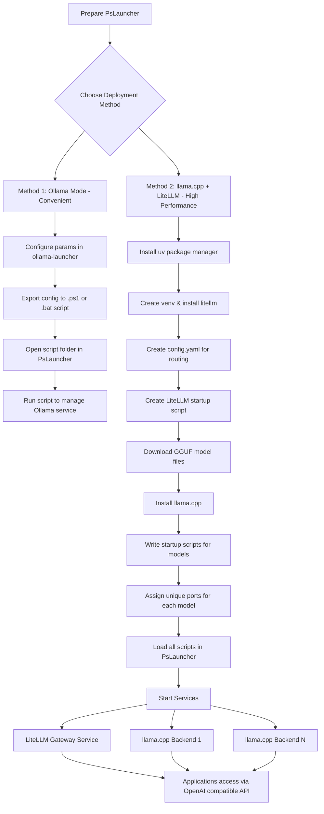

# How to Configure Local Large Model Services via PsLauncher

<center><a href='./run_llama.cpp_and_litellm_by_PsLauncher_CN.md'>中文</a> | <a href='./run_llama.cpp_and_litellm_by_PsLauncher.md'>English version</a></center>

## Introduction

I want to run large models **locally** on my own computer and have been using [ollama](https://github.com/ollama/ollama). By chance, I found that ollama always consumes more video RAM (vRAM) compared to [llama.cpp](https://github.com/ggml-org/llama.cpp). So I decided to use llama.cpp as the backend for local large model deployment (surprising, since ollama is essentially just a wrapper around llama.cpp).

However, llama.cpp itself **does not support multi-processing**, and everything has to be managed manually. Therefore, I wondered if I could build something similar to ollama to help manage services more elegantly.

I previously wrote a project: [ollama-launcher](https://github.com/NGC13009/ollama-launcher). It is purely a backend management tool, designed to be lightweight and fast. So I considered building a similar tool to meet my needs.

After research, I found that [litellm](https://github.com/BerriAI/litellm) is an excellent choice — lightweight and fast to start. This saved me from building my own gateway to dispatch different llama.cpp backends. It not only manages local models and provides a unified API interface but also integrates paid APIs like OpenRouter, making it very convenient. No more switching API configurations across multiple applications.

At first, I used multiple tabs in PowerShell and manually started litellm and multiple llama.cpp instances via pre-configured PowerShell scripts. I was fine with managing `GGUF` model files myself, so this setup worked.

But launching several terminals was inconvenient and inelegant, and I could not easily minimize them to the system tray.

Thus, after combining all my goals… this program was born.

This article explains how to configure local large models using this new approach.

## Method Overview

With this program, you can configure local large models in two ways:

1. **Easier method**: Continue using ollama, conveniently modify ollama startup parameters, and manage model services from one place — just like the original [ollama-launcher](https://github.com/NGC13009/ollama-launcher).
2. **Higher performance & flexibility**: Use the more performant but less automated (more flexible) combination: [llama.cpp](https://github.com/ggml-org/llama.cpp) + [litellm](https://github.com/BerriAI/litellm).

We will cover both methods below.



## Easier Method: ollama

In the latest version of [ollama-launcher](https://github.com/NGC13009/ollama-launcher), I added a menu bar feature that lets you **export current startup parameters and environment variables as a script**.

You need to save this script to a folder.

Then open that folder with PsLauncher — you should see the generated script (`.ps1` or `.bat`, whichever you prefer).

Simply launch it to manage the service. If you are migrating from [ollama-launcher](https://github.com/NGC13009/ollama-launcher), the workflow will feel familiar: support for minimizing to the system tray, starting/stopping, and daemon processes.

The difference is that there is no longer a GUI for quickly configuring ollama options. However, you can edit the script directly to configure everything — with **greater freedom**, and it is actually not more complicated.

Even if you know nothing about scripting syntax, you can manage fine by following examples.

## Advanced Method: litellm Gateway + llama.cpp Backend

The biggest difference between [llama.cpp](https://github.com/ggml-org/llama.cpp) and [ollama](https://github.com/ollama/ollama) is that **llama.cpp can only run one model at a time**.

Although ollama is built on llama.cpp, the development team made modifications that cause ollama to require more vRAM than raw llama.cpp.

[litellm](https://github.com/BerriAI/litellm) is a lightweight project that runs a local gateway on your device, automatically routing and forwarding APIs for various models — much like OpenRouter. It is compatible with llama.cpp, ollama, and even OpenAI-compatible API providers (such as [SiliconFlow](https://cloud.siliconflow.cn/me/models)).

With this setup, you can route **all APIs (local or remote)** through litellm and access every model from a single endpoint on your computer. **I highly recommend this method** (local model performance speaks for itself).

This method is slightly more complex, but you can follow step by step.

### 1. Install uv

[uv](https://github.com/astral-sh/uv) is a lightweight environment manager written in Rust (even smaller than this program). uv can install a fully isolated Python environment, independent of system or Conda environments.

Please install uv yourself and ensure it is added to your system `PATH`.

### 2. Install litellm

Using `uv` to manage Python virtual environments is fast and clean. To meet your needs, we will create an **isolated virtual environment** in a specified directory, install LiteLLM inside it, and call the executable directly via a batch script (`.bat`).

Below are complete steps you can run directly in **PowerShell** or **CMD** (run as Administrator if you lack write access to `C:\`):

#### 2.1 Create and enter directory

```bash
mkdir C:\application\litellm
cd C:\application\litellm
```

#### 2.2 Create a dedicated environment and install LiteLLM

When running LiteLLM as a proxy server, it requires extra web dependencies (like FastAPI and Uvicorn), so we install the full version with the `[proxy]` suffix:

```bash
# Create a virtual environment in the current directory (generates a .venv folder)
uv venv

# Install litellm proxy into the virtual environment
uv pip install "litellm[proxy]"
```

#### 2.3 Create a default config file

You can check litellm’s documentation for details. Or use my quick-start example:

```yaml
# config.yaml
model_list:
  # llama.cpp
  - model_name: llama.cpp/qwen-vl-3.5-27b-nt
    litellm_params:
      model: openai/qwen-vl-3.5-27b-nt
      api_base: "http://127.0.0.1:13080/v1"
      api_key: "sk-123"
    model_info:
      max_tokens: 65536
      max_input_tokens: 65536
      max_output_tokens: 8192
      mode: "chat"
      supports_function_calling: true
      supports_reasoning: false
      supports_response_schema: true
      supports_system_messages: true
      supports_prompt_caching: true
      supports_vision: true

litellm_settings:
  drop_params: true
  telemetry: false
```

#### 2.4 Create a one-click startup script

Due to encoding limitations, if the script contains Chinese characters, it **must be saved in GBK**; UTF-8 will likely cause garbled text.

```PowerShell
# Switch working directory to the script's location (same as cd /d "%~dp0")
$ErrorActionPreference = 'Continue'

# [Console]::OutputEncoding = [System.Text.Encoding]::UTF8

Set-Location -Path $PSScriptRoot

Write-Host "==========================================" -ForegroundColor Cyan
Write-Host"        Starting LiteLLM Gateway...        " -ForegroundColor Cyan
Write-Host "==========================================" -ForegroundColor Cyan

# Force host 127.0.0.1 for security, bind to port 13043
if (Test-Path -Path "config.yaml") {
    Write-Host "[INFO] Found config.yaml, loading..." -ForegroundColor Green

    # Use & (call operator) to run external executables in PowerShell
    & ".\.venv\Scripts\litellm.exe" --config config.yaml --host 127.0.0.1 --port 13043
} else {
    Write-Host "[ERROR] config.yaml not found! Please check the directory." -ForegroundColor Red
}
```

If you prefer `CMD` over PowerShell:

```Batch
@echo off
:: cd to current script directory
cd /d "%~dp0"

echo ==========================================
echo          LiteLLM autostart ...
echo ==========================================

:: http://127.0.0.1:13043
if exist config.yaml (
    echo [INFO] Found config.yaml ...
    .\.venv\Scripts\litellm.exe --config config.yaml --host 127.0.0.1 --port 13043
) else (
    echo [ERROR] No config.yaml here, check it!
)
```

litellm is now ready.

#### Updating litellm

To update litellm, run in the same directory:

```PowerShell
uv pip install --upgrade "litellm[proxy]"
```

### 3. Download GGUF model files

Unfortunately, llama.cpp does not manage models automatically. You must download GGUF files yourself from [ModelScope](https://www.modelscope.cn/my/overview) or [Hugging Face](https://huggingface.co/huggingface).

For this example, use [unsloth/Qwen3.5-27B-GGUF](https://www.modelscope.cn/models/unsloth/Qwen3.5-27B-GGUF).

Or download the Q4 quantized version directly:
[Qwen3.5-27B-Q4_K_M.gguf](https://www.modelscope.cn/models/unsloth/Qwen3.5-27B-GGUF/file/view/master/Qwen3.5-27B-Q4_K_M.gguf?status=2)

This model supports vision. If you want multimodal capabilities, also download the corresponding [mmproj](https://www.modelscope.cn/models/unsloth/Qwen3.5-27B-GGUF/file/view/master/mmproj-BF16.gguf?status=2) file.

Save them anywhere you like.

### 4. Install llama.cpp

Repository: [llama.cpp](https://github.com/ggml-org/llama.cpp)

Go to Releases, download a ZIP for your architecture, extract it somewhere.

> llama.cpp is updated very frequently — dozens of times a day. Frequent updates are not recommended.

Then use a startup script like this:

```PowerShell
# q3.5vl-27b.ps1
$ErrorActionPreference = 'Continue'

[Console]::OutputEncoding = [System.Text.Encoding]::UTF8

# Not strictly required in PsLauncher, since it runs scripts from their own path
$OLDPWD = $PWD
Set-Location -Path $PSScriptRoot
Write-Host "workpath changed to: $PWD"

# Use only one GPU if you have multiple
Write-Host "Setting CUDA_VISIBLE_DEVICES=0" -ForegroundColor DarkCyan
$env:CUDA_VISIBLE_DEVICES = "0"

Write-Host "Launching llama.cpp-server..." -ForegroundColor Green

# Startup command — this is a complete, optimized config
# Adjust paths and parameters to match your setup
& "./llama-b8267-bin-win-cuda-12.4-x64/llama-server.exe" `
    "-m" "E:\LLM\GGUF\Qwen3.5-27B-Q4_K_M.gguf" `
    "--mmproj" "E:\LLM\GGUF\q3.5-27b-mmproj-BF16.gguf" `
    "--threads" "1" `
    "--threads-batch" "1" `
    "-c" "8192" `
    "--temp" "0.7" `
    "--n-gpu-layers" "9999" `
    "-ctk" "f16" `
    "-ctv" "f16" `
    "--batch-size" "2048" `
    "--ubatch-size" "512" `
    "--flash-attn" "on" `
    "--fit" "off" `
    "--no-mmap" `
    "--mlock" `
    "--port" "13080" `
    "--reasoning-budget" "-1"

# Parameter explanations (run llama-server.exe -h for full list)
# -m                            # Path to GGUF model
# --mmproj                      # Path to multimodal projector (remove if not used)
# --threads" "1" `              # Number of threads ( >1 may slow down on some CPUs )
# --threads-batch" "1" `        # Threads for batch tokenization
# -c" "65536" `                 # Context length
# --temp" "0.7" `               # Temperature
# --n-gpu-layers" "9999" `      # Layers to offload to GPU (set high to maximize GPU usage)
# -ctk" "f16" `                 # K-cache data type
# -ctv" "f16" `                 # V-cache data type
# --batch-size" "2048" `        # Context chunk size for KV-cache memory optimization
# --ubatch-size" "512" `        # Context chunk size for Flash Attention
# --flash-attn" "on" `          # Enable Flash Attention
# --fit" "off" `                # Disable VRAM compromise
# --no-mmap" `                  # Disable memory mapping (slower, but stable)
# --mlock" `                    # Lock model in memory
# --port" "13080" `             # Listening port — must match litellm config
# --reasoning-budget" "-1"      # Reasoning budget for thought models. With vision, only 0 (disable) or -1 (unlimited) work here

# Restore previous directory
Set-Location -Path $OLDPWD
```

Save this script in a folder.

If you want multiple local models, write multiple similar llama.cpp startup scripts — **just use different ports**.

### 5. Launch PsLauncher

Load the folder containing your scripts, then run:

- litellm gateway
- one or more llama.cpp backends

### 6. Connect from other applications

Use the **OpenAI-compatible API**.

litellm is not strictly required, because llama.cpp already exposes an OpenAI-compatible API and even includes a web chat UI.

Direct llama.cpp API (OpenAI-compatible):

```Bash
curl http://127.0.0.1:13080/v1
```

Via litellm (one API for all models):

```Bash
curl http://127.0.0.1:13043/v1/model/info   # List configured models
```

For full usage and features, refer to the official litellm documentation.
